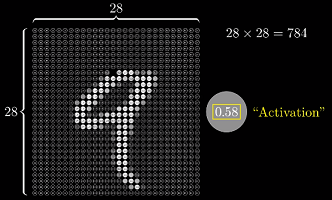
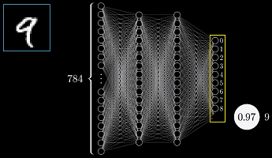
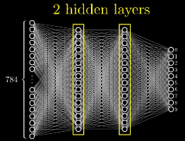
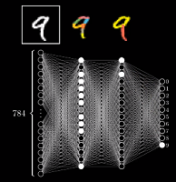
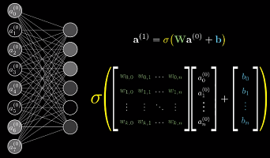
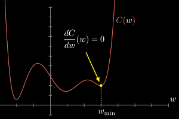
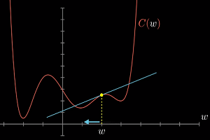

**说明**
---
该文档为“**3Blue1Brown - 深度学习系列视频**”的整理，主要包括三个视频
- [神经网络的结构](https://www.bilibili.com/video/av15532370)
- [梯度下降法](https://www.bilibili.com/video/av16144388)
- [反向传播算法](https://www.bilibili.com/video/av16577449)

让我们跟着 3Blue1Brown 从偏数学的角度来理解神经网络（原视频假设观众对神经网络没有任何背景知识）

**目录**
---
<!-- TOC -->

- [1. 神经网络的结构](#1-神经网络的结构)
  - [1.1. 神经元（隐藏单元）与隐藏层](#11-神经元隐藏单元与隐藏层)
  - [1.2. 神经网络的运作机制——权重、偏置、激活函数](#12-神经网络的运作机制权重偏置激活函数)
  - [1.3. 非线性激活函数](#13-非线性激活函数)
- [2. 梯度下降法](#2-梯度下降法)
  - [损失函数（Loss Function）](#损失函数loss-function)
  - [梯度下降法](#梯度下降法)

<!-- /TOC -->

# 1. 神经网络的结构

内容：
- 神经网络是什么？
- 神经网络的结构
- 神经网络的工作机制
- 深度学习中的“学习”指的是什么？
- 神经网络的不足

**示例：一个用于数字手写识别的神经网络**

> 这个示例相当于深度学习领域中的 "Hello World".

## 1.1. 神经元（隐藏单元）与隐藏层

**神经元（隐藏单元）**
- 简单来说，神经元可以理解为一个用来装数字的容器，而这个数称为激活值

    
    > 如果使用 sigmoid 激活函数，那么这个数字就在 0 到 1 之间；但通常来说，无论你使用哪种激活函数，这个数字都比较小

- 输入层也可以看做是一组神经元，它的激活值就是输入本身

    
    
    > 基本的神经网络只能处理向量型的输入，所以需要将这个 28*28 的像素图（矩阵），重排成长为 784 的向量
    >
    > 如果使用卷积神经网络，则可以直接处理矩阵型的输入
    
- 对于分类问题，输出层中的激活值代表这个类别正确的概率
- 所谓的“**神经元被激活**”实际上就是它获得了一个较大的激活值

    

**隐藏层**
- 包含于输入层与输出层之间的网络层统称为“隐藏层”

    
    > 在这个简单的网络中，有两个隐藏层，每层有 16 个神经元
    >
    > 为什么是两层和 16 个？——层数的大小与问题的复杂度有关，而神经元的数量目前来看是随机的——网络的结构在实验时有很大的调整余地

## 1.2. 神经网络的运作机制——权重、偏置、激活函数
- 神经网络在运作的时候，隐藏层可以视为一个“黑箱”
- 每一层的激活值将通过某种方式计算出下一层的激活值——神经网络处理信息的核心机制

    
    > 每一层被激活的神经元不同，（可能）会导致下一层被激活的神经元也不同

**为什么神经网络的分层结构能起作用？**
---
- 人在初识数字时是如何区分的？——**组合**数字的各个部分

    

- **在理想情况下**，我们希望神经网络倒数第二层中的各隐藏单元能对应上每个**基本笔画**（pattern）

    
    - 当输入是 9 或 8 这种**顶部带有圆圈**的数字时，某个神经元将被激活（激活值接近 1）
    - 不光是 9 和 8，所有顶部带有圆圈的图案都能激活这个隐藏单元
    - 这样从倒数第二层到输出层，我们的问题就简化成了“学习哪些部件能组合哪些数字”

- 类似的，基本笔画也可以由更基础的部件构成

    
    
- **理想情况下**，神经网络的处理过程

    
    > 从输入层到输出层，**网络的抽象程度越来越高**

**深度学习的本质：通过组合简单的概念来表达复杂的事物**
---
- 神经网络是不是这么做的，我们不得而知（所以是一个“黑箱”），但大量实验表明：神经网络确实在做类似的工作——**通过组合简单的概念来表达复杂的事物**

    
    > 语音识别：原始音频 → 音素 → 音节 → 单词

**隐藏单元是如何被激活的？**
---
- 我们需要设计一个机制，这个机制能够把像素拼成边，把边拼成基本图像，把基本图像拼成数字
- 这个机制的基本处理方式是：通过上一层的单元激活下一层的单元

**示例：如何使第二层的单个神经元识别出图像中的某块区域是否存在一条边**
- 根据激活的含义，当激活值接近 1 时，表示该区域存在一条边，反之不存在
- **怎样的数学公式能够表达出这个含义？**

    
    
    
    - 考虑对所有输入单元加权求和
    - 图中每条连线关联一个权值：绿色表示正值，红色表示负值，颜色越暗表示越接近 0
    - 此时，只需将需要关注的像素区域对应的权值设为正，其余为 0
    - 这样对所有像素的加权求和就只会累计我们关注区域的像素值
    - 为了使隐藏单元真正被“激活”，加权和还需要经过某个**非线性函数**，也就是“激活函数”
    - 早期最常用的激活函数是 `sigmoid` 函数（又称 logistic/逻辑斯蒂曲线）

        
        > 从 `sigmoid` 的角度看，它实际上在对加权和到底有多“正”进行打分
        
    - 但有时，可能加权和大于 10 时激活才有意义；
    - 此时，需要加上“偏置”，保证不能随便激发，比如 -10。然后再传入激活函数

**权重与偏置的实际意义**
---
- 宏观来看，**权重**在告诉你当前神经元应该更关注来自上一层的哪些单元；或者说**权重代表了连接的强弱**

- **偏置**则告诉你加权和应该多大才能使神经元的激发变得有意义；或者说**当前神经元是否更容易被激活**

**权重和偏置——网络参数**
- 每个隐藏单元都会和**上一层的所有单元**相连，每条连线上都关联着一个**权重**；
- 而每个隐藏单元又会各自带有一个**偏置**

    
    
    > 每一层都带有自己的权重与偏置，这样一个小小的网络，就有 13002 个参数

**矢量化编程**
---
- 把一层中所有的激活值作为一列**向量** `a`
- 层与层之间的权重放在一个**矩阵** `W` 中：第 n 行就是上层所有神经元与下层第 n 个神经元的权重
- 类似的，所有偏置也作为一列**向量** `b`
- 最后，将 `Wa + b` 一起传入激活函数

    
    > `sigmoid`会对结果向量中的每个值都取一次`sigmoid`

- 所谓“矢量化编程”，实际上就是将向量作为基本处理单元，避免使用 for 循环处理标量
- 通过定制处理单元（GPU运算），可以大幅加快计算速度

**机器“学习”的实质**
---
当我们在讨论机器如何“学习”时，实际上指的是机器如何正确设置这些参数

## 1.3. 非线性激活函数
**神经网络本质上是一个函数**
- 每个神经元可以看作是一个函数，其输入是上一层所有单元的输出，然后输出一个激活值
- 宏观来看，神经网络也是一个函数

    
    > 一个输入 784 个值，输出 10 个值的函数；其中有 13000 个参数

- 早期最常用的激活函数是 `sigmoid` 函数，它是一个**非线性函数**
- 暂不考虑它其他优秀的性质（使其长期作为激活函数的首选）以及缺点（使其逐渐被弃用）；

  而只考虑其**非线性**

**为什么要使用非线性激活函数？——神经网络的万能近似定理**
---
> 视频中没有提到为什么使用非线性激活函数，但这确实是神经网络能够具有如此强大**表示能力**的关键
- 使用**非线性激活函数**的目的是为了向网络中加入**非线性因素**，从而加强网络的表示能力

**为什么加入非线性因素能够加强网络的表示能力？**
- 首先要有这样一个认识，非线性函数具有比线性函数更强的表示能力。
- 如果不使用非线性激活函数，那么每一层输出都是上层输入的线性组合；

  容易验证，此时无论有多少层，神经网络都只是一个线性函数。

**万能近似定理**
- 神经网络如果具有至少一个非线性输出层，那么只要给予网络足够数量的隐藏单元，它就可以以任意的精度来近似任何从一个有限维空间到另一个有限维空间的函数。
- 这极大的扩展了神经网络的表示空间
    > 《深度学习》 6.4.1 万能近似性质和深度

**新时代的激活函数——线性整流单元 ReLU**
---
这里简单说下 sigmoid 的问题：
- `sigmoid` 函数在输入取绝对值非常大的正值或负值时会出现**饱和现象**，此时函数会对输入的微小改变会变得不敏感

    
    > 饱和现象：在图像上表现为函数值随自变量的变化区域平缓（斜率接近 0）

- 饱和现象会导致**基于梯度的学习**变得困难，并在传播过程中丢失信息（**梯度消失**）

**线性整流单元 ReLU**

- =\max(0,a))

    

- `ReLU` 取代 `sigmoid` 的主要原因就是：使神经网络更容易训练（**减缓梯度消失**）
- 此外，一种玄学的说法是，早期引入 `sigmoid` 的原因之一就是为了模仿生物学上神经元的激发

  而 `ReLU` 比 `sigmoid` 更接近这一过程。

# 2. 梯度下降法

内容：
- 梯度下降的思想
- 网络的能力分析
- 隐层神经元的真实目的

网络示例依然是那个手写识别的例子：

**神经网络是怎样学习的？**
---
- 我们需要一种算法：通过喂给这个网络大量的**训练数据**——不同的手写数字图像以及对应的数字标签

  算法会调整所有网络参数（权重和偏置）来提高网络对训练数据的表现

  此外，我们还希望这种分层结构能够举一反三，识别训练数据之外的图像——**泛化能力**

- 虽然使用了“学习”的说法，但实际上训练的过程更像在解一道**微积分问题**

  训练的过程实际上在寻找某个函数的（局部）最小值

- 在训练开始前，这些参数是随机初始化的
  > 确实存在一些随机初始化的策略，但目前来看，都只是“锦上添花”

## 损失函数（Loss Function）
---
- 显然，随机初始化不会有多好的表现
- 此时需要定义一个“**损失函数**”来告诉计算机：正确的输出应该只有标签对应的那个神经元是被激活的
- 比如这样定义单个样本的损失：

  
  
  - 当网络分类正确时，这个值就越小
  - 这里使用的损失函数为“均方误差”（mean-square error, MSE）
  
- 现在，我们就可以用所有训练样本代价的平均值来评价整个网络在这个任务上的优劣

**神经网络与损失函数的关系**
- 神经网络本身相当于一个函数

  
  > 输入是一个向量，输出是一个向量，参数是所有权重和偏置

- 损失函数在神经网络的基础上，还要再抽象一层：

  所有权重和偏置作为它的输入，输出是单个数值，表示当前网络的性能；参数是所有训练样例（？）

  
  
- 从这个角度看，损失函数并不是神经网络的一部分，而是训练神经网络时需要用到的工具

**如何优化这些网络参数？**
---
- 能够判断网络的性能并不重要，关键是如何利用它来**优化**网络参数

**示例 1：考虑只有一个参数的情况**
- 如果函数只有一个极值点，那么直接利用微积分即可

  如果函数很复杂的话，问题就不那么直接了，更遑论上万个参数的情况

  
  

- **一个启发式的思路是**：先随机选择一个值，然后考虑向左还是向右，函数值会减小；

  准确的说，如果你找到了函数在该点的斜率，**斜率为正就向左移动一小步，反之向右**；

  然后每新到一个点就重复上述过程——计算新的斜率，根据斜率更新位置；

  最后，就可能逼近函数的某个**局部极小值**点

  

- 这个想法最明显的问题是：由于无法预知最开始的值在什么位置，导致最终会到达不同的局部极小值；

  关键是无法保证落入的局部极小值就是损失函数可能达到的全局最小值；

  这也是神经网络最大的问题：

  

- 有一个策略可以保证最终解**至少**能到达一个局部极小值点：使每次**移动的步幅和斜率成正比**；

  因为在最小值附近的斜率会趋于平缓，这将导致每次移动步幅越来越小，防止跳出极值点

- **注意**：对于简单的情况，这是方法还行；

  但如果面对的是一个**巨大的网络**，这个方法反而会**限制网络的学习**，导致其陷入某个局部极小值点；

  因为当参数数量非常庞大时，可能存在无数个极值点，而其中某些极值点的结果可能非常差。
  > 优化问题是深度学习最核心的两个问题之一，另一个是正则化

**示例 2：考虑两个参数的情况**
- 输入空间是一个 XY 平面，代价函数是平面上方的曲面

  此时的问题是：在输入空间沿哪个方向移动，能使输出结果下降得最快
  
  
  
- 如果你熟悉**多元微积分**，那么应该已经有了答案：

  函数的**梯度**指出了函数的“**最陡**”增长方向，即沿着梯度的方向走，函数增长最快；

  换言之，沿梯度的负方向走，函数值也就下降得最快；
  
  此外，梯度向量的长度还代表了斜坡的“陡”的程度。

- 处理更多的参数也是同样的办法：

## 梯度下降法

1. 计算负梯度
1. 按梯度的负方向下降一小步
1. 重复

  

- 梯度下降法的一般处理方式：
  - 将所有网络参数放在一个列向量中
  - 那么损失函数的扶梯度也是一个向量

    

