**说明**
---
该文档为“[3Blue1Brown - 微积分的本质系列视频](https://www.bilibili.com/video/av24325548)”的整理，用于回忆微积分的一些基本概念

**目录**
---
<!-- TOC -->

- [1. 微积分引言](#1-微积分引言)
    - [1.1. 推导圆的面积 - 积分的直观理解](#11-推导圆的面积---积分的直观理解)
    - [1.2. 积分与导数](#12-积分与导数)
- [2. 导数（Derivative）的意义](#2-导数derivative的意义)
    - [2.1. “瞬时变化率”引起的歧义——导数的悖论](#21-瞬时变化率引起的歧义导数的悖论)
    - [2.2. 导数的定义](#22-导数的定义)
- [3. 用几何来求导](#3-用几何来求导)
- [4. 链式法则 & 求导法则](#4-链式法则--求导法则)
    - [4.1. 加法法则](#41-加法法则)
    - [4.2. 乘法法则](#42-乘法法则)
    - [4.3. 复合函数的求导法则——链式法则](#43-复合函数的求导法则链式法则)
- [5. 指数函数求导](#5-指数函数求导)

<!-- /TOC -->

# 1. 微积分引言

**微积分回忆**
- 求导公式
- 乘积法则
- 链式法则
- 隐函数求导
- 积分、微分的互逆关系
- 泰勒级数
- ...

**微积分的三个中心思想：**
1. 积分
1. 微分
1. 积分与微分（导数）的互逆

**（几位）微积分之父**
- 发现微积分：巴罗（Barrow）、牛顿（Newton）、莱布尼茨（Leibniz）
- 给出严格定义：柯西（Cauchy）、魏尔施特拉斯（Weierstrass）

## 1.1. 推导圆的面积 - 积分的直观理解

圆的面积公式：

**如何从积分的角度推导出圆的面积公式？**

不同的划分方法会带来不同的积分公式，下面考虑将圆划分为大量的同心圆环，这种方法保留了圆的对称性。

考虑其中一个环的面积，可以将其看做一个“类矩形”

虽然这不是标准的矩形，但只要`dr`越小，它就越接近。它的面积可表示为：

于是，圆的面积可以看作是这一系列矩形面积的叠加。

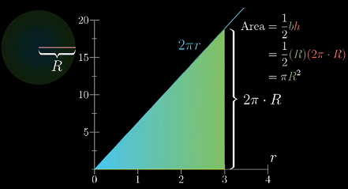

这部分面积的求和可以等价于求“**函数`y = 2πr`图像在区间`[0, R]`下的面积**”。

这个推导的过程其实可以看作是对函数`y = 2πr`在`[0, R]`下的积分。

## 1.2. 积分与导数

直观来说，对函数`f(x)`在`[a, b]`上**积分**就是求函数`f(x)`在区间`[a,b]`下的图像与坐标轴包围的面积。记作：

dx)
> 这实际上是**定积分**的概念，此外还有不定积分。

如果是其他图像，比如抛物线，该怎么求这部分的面积呢？

能不能找到一个函数 `A(x)` 表示 `0` 到 `x` 之间函数图像下的面积？——这个函数 `A(x)` 就是该函数的**积分**（函数）。
> 这里强调 `0` 到 `x` 之间，是为了使问题具有实际意义

以抛物线 `f(x)=x^2` 为例。类似的，我们可以将这块区域划分成一系列细长的矩形。

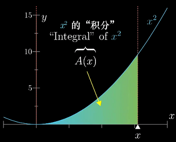

将 `x` 增加 `dx`，增加的面积可以看做是一个长`f(x)`、宽`dx`的矩形，只要`dx`越小，这条窄带就越接近矩形。

把这部分面积记作 `dA`，表示面积的微小变化（difference in Area）

通过这个矩形，可以得到 `A`、`f(x)` 与 `dx` 之间的关系：

dx&space;\\&space;\Rightarrow&space;&&space;\frac{dA}{dx}\approx&space;f(x)&space;\\&space;\Rightarrow&space;&&space;\frac{A(x&plus;dx)-A(x)}{dx}&space;\approx&space;f(x)&space;\end{aligned}}})

这里引出了微积分中另一个重要的概念——**导数**。`dA/dx` 就是 "A 的导数"
> 更严格的说法是："A 的导数"是“当 `dx → 0` 时，`dA/dx` 所趋向的值”。（下一节会讨论导数的定义）
>
> 一般不会刻意区分**导数**和**导数函数**的区别，都统称为**导数**，具体含义视语境而定；同样，积分也是如此。

导数是解决积分问题的关键——积分需要还原出某个导数原本的函数——如果你能熟练的计算导数，那么你也能解决这个问题。

积分与导数之间的这种互相转化的关系，也就是“某个图像下方面积函数的导数能够还原出定义这个图像的函数”，就叫做**微积分基本定理**。该定理表明，“在某种意义上”，两者互为逆运算。

# 2. 导数（Derivative）的意义

## 2.1. “瞬时变化率”引起的歧义——导数的悖论

“瞬时变化率”的歧义——只有在不同的时间点之间，变化才能发生；而将时间限制在某个瞬间点的时候，变化也就不存在了。

考虑这个示例：一辆车从 A 点起，先加速，再减速，至 100 米外的 B 点停下，整个过程花费 10 秒。

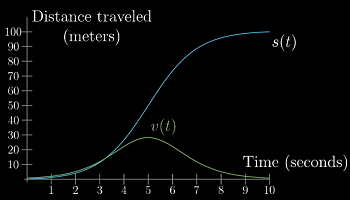

把车速的图像加入其中，可以发现：两者存在着某种联系：其中之一改变的话，也会引起另一个发生变化。

<!-- 直觉上，速度越大，距离-时间函数的图像也越陡峭，意味着车在单位时间内移动的距离更长 -->

**“瞬时”速度的矛盾**：
- 在绘制速度图像的时候，需要给每个单独的时间点关联一个速度值，但是计算速度却需要两个时间点上的距离。

    
    > 当年的微积分创始人们也经历了同样的思维冲突。

- 换言之，速度只有在一段会时间内的才有意义；“瞬时”的说法会带来矛盾

## 2.2. 导数的定义

**速度的大小是如何随着距离-时间函数的变化而变化的？**
- 记时间差为 `dt`，距离差为 `ds`，那么这段时间内的速度就能用 `ds/dt` 表示
- 现实生活中：会选取一个很小的 `dt` 值，然后把 `ds/dt` 看做是这个瞬间的速度。

**导数的定义**
---
- 在纯数学领域，**导数**不是 `dt` 为某个具体值时 `ds/dt` 的值 ，而是当 `dt` 的值**无限逼近 0 时**这个比值的**极限**。
- 从图像的角度，（某一点的）导数有一个直观的含义：就是经过图像上该点切线的斜率。
- 注意：这里的 `dt` 不是“无穷小”，也不是 0；它永远是一个有限小的量，接近 0 而不是 0。
    > 这种说法在试图规避“瞬时”带来的矛盾，使“某个时间点的变化率”有意义。

    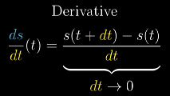
    > 数学中，当你使用 `d` 时，就表明 `dt` 是一个趋于 0 的值。

**导数的求解**
---
抛开求导公式，先来看一下面对一个实际的问题，该如何求解（在某一点处的）导数。
- 求 `s(t)=t^3` 在 `t=2` 处的导数
- 根据导数的定义，有

    [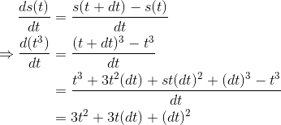](http://www.codecogs.com/eqnedit.php?latex=\begin{aligned}&space;\frac{ds(t)}{dt}&space;&=\frac{s(t&plus;dt)-s(t)}{dt}\\&space;\Rightarrow&space;\frac{d(t^3)}{dt}&space;&=\frac{(t&plus;dt)^3-t^3}{dt}\\&space;&=\frac{t^3&plus;3t^2(dt)&plus;st(dt)^2&plus;(dt)^3-t^3}{dt}\\&space;&=3t^2&plus;3t(dt)&plus;(dt)^2&space;\end{aligned})

- 当 `dt` 趋向 0 时，后两项也会趋于 0，进而消去。代入 `t=2` 可以得到在该点处的导数为 12
- 更一般的，称 `s'(t) = 3*t^2` 为 `s(t) = t^3` 的**导函数**。

> 对于常见的函数，有一系列总结出的**求导公式**可以快速计算（下一节会演示如何从几何的角度来推导这些公式）

**导数的含义是“变化率的最佳近似”**
---
- 回顾之前关于距离-速度的示例，思考这个问题：当 `t=0` 时，车在不在移动？
- 一方面，利用导函数公式可以得到 `t=0` 时的速度为 0——这似乎在说“车没有移动”；另一方面，如果车在 0 时刻没有移动，那么它是何时开始移动的？——关键在于这个问题本身就是没有意义的。
- 因为**导数**并不是用来测量“瞬时变化”的。
- `t=0`点的导数为 0 的真正含义是指“在第 0 秒附近，车速的**最佳近似**为 0 米/秒”——换句话说，就是当时间间隔 `dt` 越来越小时，表示速度的比值 `ds/dt` 就越趋向于 0——这并不表示车在 0 时刻就是静止的，只能说它此时的速度近似于 0.

# 3. 用几何来求导
> 注意：这系列视频中，似乎没有很区分导数与微分，所有导数都是以 `df/dx` 的形式表现的。

为什么导数很重要？——当需要使用微积分来解决现实中的实际问题时，需要将其抽象成各种代表性的函数来描述；而如果能掌握这些抽象函数的变化率，那你就学会了这门可以精准描述事物变化率的语言。

**从几何的角度看“微小变化量”**
---
以 `f(x) = x^2` 为例：
- 从坐标轴上看，`x^2` 的图像是一条抛物线，我们已经知道，导数可以描述为切线的斜率
- 此外，`x^2` 还有另一个更直接的含义：长为 `x` 的正方形的面积。
- 假如给边长 `x` 一个微小的增量 `dx`，那么正方形的增量（变化量）是多少？

    

- 应该时刻记住的 `dx` 是一个微小的量——这意味着你可以**忽略所有次数高于 1 的 `dx` 项**——换言之，一个微小量的平方（或更高次方）是一个可以忽略的变化量
- 由此，可以得到：

    

- 上一节给出了 `f(x) = x^3` 导数的代数推导过程，这里也可以作为立方体体积来用几何的方式推导。
    
    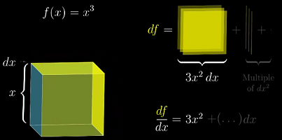

**负的变化量**
- 上述两个例子的变化量都是增量（正值），但实际上**变化量也可能是负值**，比如 `f(x) = 1/x`——考虑这样一个特殊的矩形，长 `x`，宽 `1/x`，它的面积恒为 1.

    
    > 注意：这里的变化量不再是矩形的面积了，而是**矩形的高**

- 通过简单的几何知识，可知矩形**高**的变化量为：

    =-(\frac{1}{x}-\frac{1}{x&plus;dx}))

- 从而得到 `1/x` 的导数为：

    =\frac{-dx}{x^2&plus;xdx}&space;\\&space;\Rightarrow&space;&&space;\frac{d(\frac{1}{x})}{dx}=\frac{-1}{x^2&plus;xdx}=-\frac{1}{x^2}&space;\end{aligned})
    
**幂函数的导数**
- 以上 `x^2`、`x^3` 和 `x^-1` 都遵循了幂函数的求导公式：

    }{dx}=nx^{n-1})
    
- 思考一下为什么这个公式也适用于 2 和 3 以外的指数——求导的一个关键点在于很大一部分项因为包含 `dx` 的高次幂，可以被忽略——因此有

    

- 当指数小于 0 时，会更复杂一些——比如 `x^-2` 可以考虑一个边长为 `√x` 的正方形。

大多数时候，我们都有合适的求导公式来使用，但是以上利用几何求导的过程能锻炼我们借助**微小变化量**来考虑的导数的能力。

**三角函数的导数**
- 正弦函数的定义

    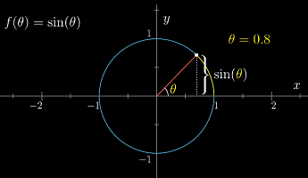
    
    - `θ=0.8` 表示单位圆弧长为 `0.8` 时对应的角度为 `θ`（单位圆的周长为 `2π`）
    - `sin(θ)` 表示此时该点距离 x 轴的高度（可能为负）
    - 当 `θ` 增加时，`sin(θ)` 的值会在 -1 到 1 之间上下摆动

- `sin(θ)` 当 `θ` 增加时的微小变化量

    
    - 在近似的观点下，应该有这样的直觉——可以把那一段微小的圆弧`dθ`看作是直线

- 根据三角函数的定义，有

    =\cos\theta\,d\theta\\\Rightarrow&space;&\frac{d(\sin\theta)}{d\theta}=\cos\theta&space;\end{aligned})

# 4. 链式法则 & 求导法则

**求导公式概览（3）**：
- 函数的和/差——加法法则
- 函数的积/商——乘法法则
- 复合函数的求导法则

## 4.1. 加法法则

&plus;h(x))=\frac{dg}{dx}&plus;\frac{dh}{dx}\\&space;\end{aligned})

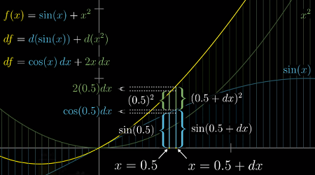
> 加法法则比较简单，可以在坐标轴中展示

## 4.2. 乘法法则

“左乘**右导** + 右乘**左导**”：

h(x))=h(x)\frac{d\,g(x)}{dx}&plus;g(x)\frac{d\,h(x)}{dx}&space;\end{aligned})

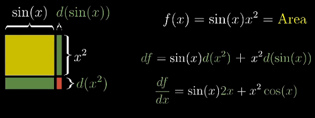
> 在数学中，如果你要处理两项的乘积，用**面积**来理解会更方便

## 4.3. 复合函数的求导法则——链式法则

**链式法则**：

)=\frac{dg(h(x))}{dh(x)}\frac{dh(x)}{dx}=\frac{dg}{dh}\frac{dh}{dx}&space;\end{aligned})

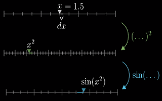

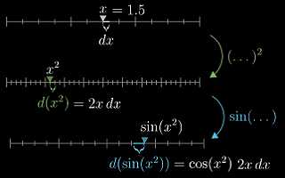
> 链式法则的表达式在说：看看输出值 g 的微小变化除以 h 的微小变化是多少（h 是要带入函数 g 中的值）；然后乘以 h 微小变化与 x 微小变化的比值

> 这些 `dh` 最终会被消去，结果就是输出值 g 的微小变化与输入值 x 的微小变化的比值
>
> `dh` 的消去并不只是符号上的技巧，而是真实反映出在求导时，各微小变化量发生了什么（？）

**了解这些求导法则 != 灵活的使用它们**

# 5. 指数函数求导

