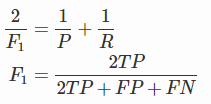

专题-机器学习实践
===

Index
---
<!-- TOC -->

  - [超参数选择](#超参数选择)
    - [Grid Search](#grid-search)
    - [Random Search](#random-search)
  - [几种参数估计的区别于联系: MLE、MAP、贝叶斯 TODO](#几种参数估计的区别于联系-mlemap贝叶斯-todo)
  - [余弦相似度（Cos距离）与欧氏距离的区别和联系](#余弦相似度cos距离与欧氏距离的区别和联系)
  - [监督学习和无监督学习](#监督学习和无监督学习)
  - [熵，求投掷均匀正六面体骰子的熵](#熵求投掷均匀正六面体骰子的熵)
  - [混淆矩阵、模型度量指标：准确率、精确率、召回率、F1 值等](#混淆矩阵模型度量指标准确率精确率召回率f1-值等)
  - [如何处理数据中的缺失值](#如何处理数据中的缺失值)
  - [介绍一个完整的机器学习项目流程](#介绍一个完整的机器学习项目流程)
- [数据清洗与特征处理](#数据清洗与特征处理)
  - [关联规则挖掘的 3 个度量指标：支持度、置信度、提升度](#关联规则挖掘的-3-个度量指标支持度置信度提升度)

<!-- /TOC -->

## 超参数选择

###  Grid Search
- 在高维空间中对一定区域进行遍历

### Random Search
- 在高维空间中随机选择若干超参数

## 几种参数估计的区别于联系: MLE、MAP、贝叶斯 TODO


## 余弦相似度（Cos距离）与欧氏距离的区别和联系
> geekcircle/machine-learning-interview-qa/[4.md](https://github.com/geekcircle/machine-learning-interview-qa/blob/master/questions/4.md)

- 欧式距离和余弦相似度都能度量 2 个向量之间的相似度
- 放到向量空间中看，欧式距离衡量两点之间的**直线距离**，而余弦相似度计算的是两个向量之间的**夹角**
- **没有归一化时**，欧式距离的范围是 (0, +∞]，而余弦相似度的范围是 (0, 1]；余弦距离是计算**相似程度**，而欧氏距离计算的是**相同程度**（对应值的相同程度）
- **归一化的情况下**，可以将空间想象成一个超球面（三维），欧氏距离就是球面上两点的直线距离，而向量余弦值等价于两点的球面距离，本质是一样。

> [欧氏距离和余弦相似度的区别是什么？](https://www.zhihu.com/question/19640394) - 知乎 

## 监督学习和无监督学习
> geekcircle/machine-learning-interview-qa/[6.md](https://github.com/geekcircle/machine-learning-interview-qa/blob/master/questions/6.md)


## 熵，求投掷均匀正六面体骰子的熵
> geekcircle/machine-learning-interview-qa/[7.md](https://github.com/geekcircle/machine-learning-interview-qa/blob/master/questions/7.md)

什么是熵？
> 深度学习/理论知识/[16. 信息熵、KL 散度（相对熵）与交叉熵**](../深度学习/README.md#16-信息熵kl-散度相对熵与交叉熵)

**求投掷均匀正六面体骰子的熵**

- 问题描述：向空中投掷硬币，落地后有两种可能的状态，一个是正面朝上，另一个是反面朝上，每个状态出现的概率为1/2。如投掷均匀的正六面体的骰子，则可能会出现的状态有6个，每一个状态出现的概率均为1/6。试通过计算来比较状态的不确定性与硬币状态的不确定性的大小。

- 答：

    硬币：[](http://www.codecogs.com/eqnedit.php?latex=-\sum^{n}_{i=1}P(X_i)\log&space;P(X_i)&space;=&space;-2*\frac{1}{2}*\log&space;P(\frac{1}{2})\approx&space;1&space;\text{bit})

    六面体：[](http://www.codecogs.com/eqnedit.php?latex=-\sum^{n}_{i=1}P(X_i)\log&space;P(X_i)&space;=&space;-6*\frac{1}{6}*\log&space;P(\frac{1}{6})\approx&space;2.6&space;\text{bit})


## 混淆矩阵、模型度量指标：准确率、精确率、召回率、F1 值等

**混淆矩阵**

- True Positive(TP)：将正类预测为正类的数量.
- True Negative(TN)：将负类预测为负类的数量.
- False Positive(FP)：将负类预测为正类数 → 误报 (Type I error).
- False Negative(FN)：将正类预测为负类数 → 漏报 (Type II error).

    

**准确率**（accuracy）


**精确率**（precision）


> 准确率与精确率的区别：
>> 在正负样本不平衡的情况下，**准确率**这个评价指标有很大的缺陷。比如在互联网广告里面，点击的数量是很少的，一般只有千分之几，如果用acc，即使全部预测成负类（不点击）acc 也有 99% 以上，没有意义。
    
**召回率**（recall, sensitivity, true positive rate）


**F1值**——精确率和召回率的调和均值



> 只有当精确率和召回率都很高时，F1值才会高


## 如何处理数据中的缺失值
> geekcircle/machine-learning-interview-qa/[1.md](https://github.com/geekcircle/machine-learning-interview-qa/blob/master/questions/1.md)

可以分为以下 2 种情况：

1. **缺失值较多**
    - 直接舍弃该列特征，否则可能会带来较大的噪声，从而对结果造成不良影响。
1. **缺失值较少**
    - 当缺失值较少（<10%）时，可以考虑对缺失值进行填充，以下是几种常用的填充策略：
    1. 用一个**异常值**填充（比如 0），将缺失值作为一个特征处理

        ` data.fillna(0) `

    1. 用**均值**|**条件均值**填充
        > 如果数据是不平衡的，那么应该使用条件均值填充
        >
        > 所谓**条件均值**，指的是与缺失值所属标签相同的所有数据的均值

        `data.fillna(data.mean())`

    1. 用相邻数据填充

        ```
        # 用前一个数据填充
        data.fillna(method='pad')
        # 用后一个数据填充
        data.fillna(method='bfill') 
        ```
        
    1. 插值

        `data.interpolate()`

    1. 拟合
        > 简单来说，就是将缺失值也作为一个预测问题来处理：将数据分为正常数据和缺失数据，对有值的数据采用随机森林等方法拟合，然后对有缺失值的数据进行预测，用预测的值来填充。


## 介绍一个完整的机器学习项目流程
> geekcircle/machine-learning-interview-qa/[2.md](https://github.com/geekcircle/machine-learning-interview-qa/blob/master/questions/2.md)

1. 数学抽象

    明确问题是进行机器学习的第一步。机器学习的训练过程通常都是一件非常耗时的事情，胡乱尝试时间成本是非常高的。

    这里的抽象成数学问题，指的是根据数据明确任务目标，是分类、还是回归，或者是聚类。

1. 数据获取

    数据决定了机器学习结果的上限，而算法只是尽可能逼近这个上限。

    数据要有代表性，否则必然会过拟合。

    对于分类问题，数据偏斜不能过于严重（平衡），不同类别的数据数量不要有数个数量级的差距。

    对数据的量级要有一个评估，多少个样本，多少个特征，据此估算出内存需求。如果放不下就得考虑改进算法或者使用一些降维技巧，或者采用分布式计算。

1. 预处理与特征选择

    良好的数据要能够提取出良好的特征才能真正发挥效力。

    预处理/数据清洗是很关键的步骤，往往能够使得算法的效果和性能得到显著提高。归一化、离散化、因子化、缺失值处理、去除共线性等，数据挖掘过程中很多时间就花在它们上面。这些工作简单可复制，收益稳定可预期，是机器学习的基础必备步骤。

    筛选出显著特征、摒弃非显著特征，需要机器学习工程师反复理解业务。这对很多结果有决定性的影响。特征选择好了，非常简单的算法也能得出良好、稳定的结果。这需要运用特征有效性分析的相关技术，如相关系数、卡方检验、平均互信息、条件熵、后验概率、逻辑回归权重等方法。

1. 模型训练与调优

    直到这一步才用到我们上面说的算法进行训练。
    
    现在很多算法都能够封装成黑盒使用。但是真正考验水平的是调整这些算法的（超）参数，使得结果变得更加优良。这需要我们对算法的原理有深入的理解。理解越深入，就越能发现问题的症结，提出良好的调优方案。

1. 模型诊断

    如何确定模型调优的方向与思路呢？这就需要对模型进行诊断的技术。

    过拟合、欠拟合 判断是模型诊断中至关重要的一步。常见的方法如交叉验证，绘制学习曲线等。过拟合的基本调优思路是增加数据量，降低模型复杂度。欠拟合的基本调优思路是提高特征数量和质量，增加模型复杂度。

    误差分析也是机器学习至关重要的步骤。通过观察误差样本，全面分析误差产生误差的原因:是参数的问题还是算法选择的问题，是特征的问题还是数据本身的问题......

    诊断后的模型需要进行调优，调优后的新模型需要重新进行诊断，这是一个反复迭代不断逼近的过程，需要不断地尝试， 进而达到最优状态。

1. 模型融合/集成

    一般来说，模型融合后都能使得效果有一定提升。而且效果很好。

    工程上，主要提升算法准确度的方法是分别在模型的前端（特征清洗和预处理，不同的采样模式）与后端（模型融合）上下功夫。因为他们比较标准可复制，效果比较稳定。而直接调参的工作不会很多，毕竟大量数据训练起来太慢了，而且效果难以保证。

1. 上线运行

    这一部分内容主要跟工程实现的相关性更大。工程上是结果导向，模型在线上运行的效果直接决定模型的成败。不单纯包括其准确程度、误差等情况，还包括其运行的速度(时间复杂度)、资源消耗程度（空间复杂度）、稳定性是否可接受。

    这些工作流程主要是工程实践上总结出的一些经验。并不是每个项目都包含完整的一个流程。这里的部分只是一个指导性的说明，只有多实践，多积累项目经验，才会有自己更深刻的认识。


# 数据清洗与特征处理
> geekcircle/machine-learning-interview-qa/[8.md](https://github.com/geekcircle/machine-learning-interview-qa/blob/master/questions/8.md)

**数据清洗**

**特征处理**


> [机器学习中的数据清洗与特征处理综述](https://tech.meituan.com/machinelearning-data-feature-process.html) - 美团点评技术

## 关联规则挖掘的 3 个度量指标：支持度、置信度、提升度

**支持度**（Support）
---
X → Y 的支持度表示项集 {X,Y} 在总项集中出现的概率

[](http://www.codecogs.com/eqnedit.php?latex=Support(X\rightarrow&space;Y)=\frac{P(X\cup&space;Y)}{P(I)}=\frac{\text{num}(X\cup&space;Y)}{\text{num}(I)})

其中，I 表示总事务集，`num()`表示事务集中特定项集出现的次数，`P(X)=num(X)/num(I)`

**置信度**（Confidence）
---
X → Y 的置信度表示在先决条件 X 发生的情况下，由规则 X → Y 推出 Y 的概率。

[](http://www.codecogs.com/eqnedit.php?latex=Confidence(X\rightarrow&space;Y)=P(Y|X)=\frac{P(X\cup&space;Y)}{P(X)}=\frac{\text{num}(X\cup&space;Y)}{\text{num}(X)})

**提升度**（Lift）
---
X → Y 的提升度表示含有X的条件下，同时含有Y的概率，与Y总体发生的概率之比。

[](http://www.codecogs.com/eqnedit.php?latex={\displaystyle&space;{\begin{aligned}&space;Lift(X\rightarrow&space;Y)&=\frac{P(Y|X)}{P(Y)}=\frac{Confidence(X\rightarrow&space;Y)}{\text{num}(Y)/\text{num}(I)}\\&space;&=\frac{P(X\cup&space;Y)}{P(X)P(Y)}=\frac{\text{num}(X\cup&space;Y)\text{num}(I)}{\text{num}(X)\text{num}(Y)}&space;\end{aligned}}})

规则的有效性：
---
- 满足最小支持度和最小置信度的规则，叫做“强关联规则”
    > 最小支持度和最小置信度是人工设置的阈值
- `Lift(X→Y) > 1` 的 X→Y 是有效的强关联规则
- `Lift(X→Y) <=1` 的 X→Y 是有效的强关联规则
- 特别地，`Lift(X→Y) = 1` 时，X 与 Y 相互独立。

**判断规则的有效性**
---
问题：已知有1000名顾客买年货，分为甲乙两组，每组各500人，其中甲组有500人买了茶叶，同时又有450人买了咖啡；乙组有450人买了咖啡，如表所示，请问“茶叶→咖啡”是一条有效的关联规则吗？

组次 | 买茶叶的人数 | 买咖啡的人数
--- | ---------- | ---------
 甲组（500人） | 500 | 450
 乙组（500人） | 0 | 450

 答：
 - “茶叶→咖啡”的支持度：Support(X→Y) = 450 / 1000 = 45%
 - “茶叶→咖啡”的置信度：Confidence(X→Y) = 450 / 500 = 90%
 - “茶叶→咖啡”的提升度：Lift(X→Y) = 90% / 90% = 1
 
 由于提升度 `Lift(X→Y) = 1`，表示 X 与 Y 相互独立。也就是说，是否购买咖啡，与是否购买茶叶无关联。规则“茶叶→咖啡”不成立，或者说几乎没有关联，虽然它的置信度高达90%，但它不是一条有效的关联规则。