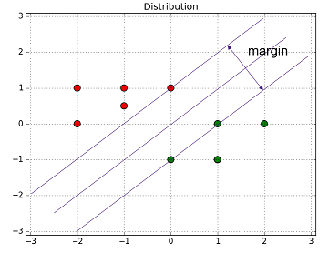

**算法列表**
---
<!-- TOC -->

- [1. 逻辑斯蒂回归（Logistic Regression, LR）](#1-逻辑斯蒂回归logistic-regression-lr)
    - [1.1. LR 推导](#11-lr-推导)
- [2. 支持向量机（SVM）***](#2-支持向量机svm)
    - [2.1. **线性** SVM 推导](#21-线性-svm-推导)
    - [2.2. 支持向量机中的支持向量是什么意思？](#22-支持向量机中的支持向量是什么意思)
    - [2.3. 以下哪些点属于支持向量？](#23-以下哪些点属于支持向量)
- [3. 朴素贝叶斯（Naive Bayes）***](#3-朴素贝叶斯naive-bayes)
    - [3.1. 朴素贝叶斯分类某个类别概率为 0 怎么办？](#31-朴素贝叶斯分类某个类别概率为-0-怎么办)
- [4. 决策树（Decision Tree）**](#4-决策树decision-tree)
    - [4.1. ID3 算法](#41-id3-算法)
    - [4.2. C4.5 算法](#42-c45-算法)
    - [4.3. CART 树](#43-cart-树)

<!-- /TOC -->

# 1. 逻辑斯蒂回归（Logistic Regression, LR）

## 1.1. LR 推导

[?] 推导一般指的是得到最终损失函数的过程

# 2. 支持向量机（SVM）***

## 2.1. **线性** SVM 推导

## 2.2. 支持向量机中的支持向量是什么意思？

简单来说，就是指哪些对分类起决定作用的向量

在远离分割线的区域，即使增加大量的样本点，对于分割线的位置也是没有作用的；因为分割线是由几个关键点决定的（图上三个），**这几个关键点支撑起了一个分割超平面**，这些关键点就是**支持向量**。

> [支持向量机(SVM)是什么意思？](https://www.zhihu.com/question/21094489) - 知乎

## 2.3. 以下哪些点属于支持向量？
> geekcircle/machine-learning-interview-qa/[10.md](https://github.com/geekcircle/machine-learning-interview-qa/blob/master/questions/10.md)

    +：(−1,1),(1,−1),(−1,−1)
    −：(1,1),(2,0),(2,1)

    答：(−1,1),(1,−1) 和 (1,1),(2,0)

# 3. 朴素贝叶斯（Naive Bayes）***

**朴素的假设**
---

## 3.1. 朴素贝叶斯分类某个类别概率为 0 怎么办？
> geekcircle/machine-learning-interview-qa/[13.md](https://github.com/geekcircle/machine-learning-interview-qa/blob/master/questions/13.md)

# 4. 决策树（Decision Tree）**

## 4.1. ID3 算法

## 4.2. C4.5 算法

## 4.3. CART 树