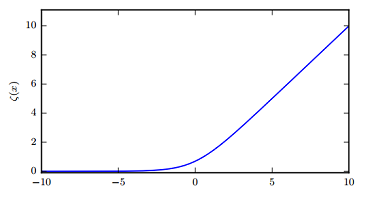
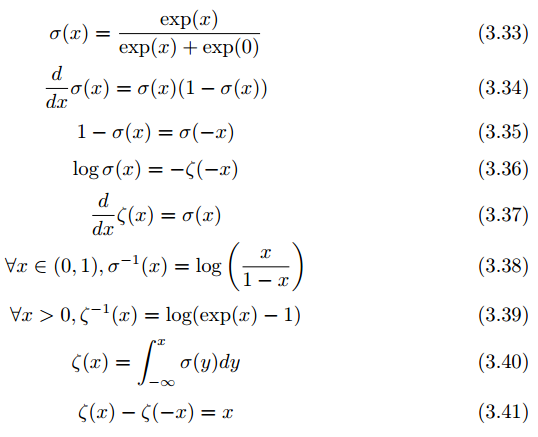
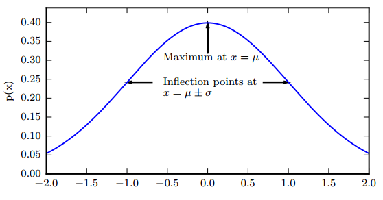

**问题列表**
<!-- TOC -->

- [1. 如何设置网络的初始值？(***)](#1-如何设置网络的初始值)
- [2. 梯度爆炸的解决办法](#2-梯度爆炸的解决办法)
- [3. MLP 的万能近似定理](#3-mlp-的万能近似定理)
- [4. 在 MLP 中，深度与宽度的关系，及其表示能力的差异](#4-在-mlp-中深度与宽度的关系及其表示能力的差异)
- [5. 稀疏表示，低维表示，独立表示](#5-稀疏表示低维表示独立表示)
- [6. 局部不变性（平滑先验）及其在基于梯度的学习上的局限性](#6-局部不变性平滑先验及其在基于梯度的学习上的局限性)
- [7. 为什么交叉熵损失相比均方误差损失能提高以 sigmoid 和 softmax 作为激活函数的层的性能？](#7-为什么交叉熵损失相比均方误差损失能提高以-sigmoid-和-softmax-作为激活函数的层的性能)
- [8. 分段线性单元（如 ReLU）代替 sigmoid 的利弊](#8-分段线性单元如-relu代替-sigmoid-的利弊)
- [9. 在做正则化过程中，为什么只对权重做正则惩罚，而不对偏置做权重惩罚](#9-在做正则化过程中为什么只对权重做正则惩罚而不对偏置做权重惩罚)
- [10. 列举常见的一些范数及其应用场景，如 L0, L1, L2, L∞, Frobenius 范数](#10-列举常见的一些范数及其应用场景如-l0-l1-l2-l∞-frobenius-范数)
    - [权重衰减的目的](#权重衰减的目的)
- [11. L1 和 L2 范数的异同](#11-l1-和-l2-范数的异同)
- [12. 为什么 L1 正则化可以产生稀疏权值，L2 正则化可以防止过拟合？](#12-为什么-l1-正则化可以产生稀疏权值l2-正则化可以防止过拟合)
    - [为什么 L1 正则化可以产生稀疏权值，而 L2 不会？](#为什么-l1-正则化可以产生稀疏权值而-l2-不会)
    - [为什么 L1 和 L2 正则化可以防止过拟合？](#为什么-l1-和-l2-正则化可以防止过拟合)
- [13. 简单介绍常用的激活函数，如 sigmoid, relu, softplus, tanh, RBF 及其应用场景](#13-简单介绍常用的激活函数如-sigmoid-relu-softplus-tanh-rbf-及其应用场景)
    - [整流线性单元（ReLU）](#整流线性单元relu)
    - [sigmoid 与 tanh（双曲正切函数）](#sigmoid-与-tanh双曲正切函数)
    - [其他激活函数（隐藏单元）](#其他激活函数隐藏单元)
    - [sigmoid 和 softplus 的一些性质](#sigmoid-和-softplus-的一些性质)
- [14. Jacobian 和 Hessian 矩阵及其在深度学习中的重要性](#14-jacobian-和-hessian-矩阵及其在深度学习中的重要性)
- [15. 信息论、KL 散度（相对熵）与交叉熵](#15-信息论kl-散度相对熵与交叉熵)
    - [自信息与信息熵](#自信息与信息熵)
    - [相对熵（KL 散度）与交叉熵](#相对熵kl-散度与交叉熵)
- [16. 如何避免数值计算中的上溢和下溢问题，以 softmax 为例](#16-如何避免数值计算中的上溢和下溢问题以-softmax-为例)
- [17. 训练误差、泛化误差；过拟合、欠拟合；模型容量，表示容量，有效容量，最优容量的概念； 奥卡姆剃刀原则](#17-训练误差泛化误差过拟合欠拟合模型容量表示容量有效容量最优容量的概念-奥卡姆剃刀原则)
- [18. 高斯分布的广泛应用的原因](#18-高斯分布的广泛应用的原因)
    - [高斯分布（Gaussian distribution）](#高斯分布gaussian-distribution)
    - [为什么推荐使用高斯分布？](#为什么推荐使用高斯分布)

<!-- /TOC -->

### 1. 如何设置网络的初始值？(***)

一般总是使用服从（截断）高斯或均匀分布的随机值，具体是高斯还是均匀分布影响不大，但是也没有详细的研究。

但是，**初始值的大小**会对优化结果和网络的泛化能力产生较大的影响：更大的初始值有助于避免冗余的单元和梯度消失；但如果初始值太大，又会造成梯度爆炸。

> 《深度学习》 ch8.4 - 参数初始化策略

一些启发式初始化策略通常是根据输入与输出的单元数来决定初始权重的大小，比如 Glorot and Bengio (2010) 中建议建议使用的标准初始化，其中 m 为输入数，n 为输出数

<a href="http://www.codecogs.com/eqnedit.php?latex=W_{i,j}&space;\sim&space;U(-\sqrt{\frac{6}{m&plus;n}},\sqrt{\frac{6}{m&plus;n}})" target="_blank"></a>

还有一些方法推荐使用随机正交矩阵来初始化权重 (Saxe et al., 2013)。

> 常用的初始化策略可以参考 Keras 中文文档：[初始化方法Initializers](http://keras-cn.readthedocs.io/en/latest/other/initializations/)


### 2. 梯度爆炸的解决办法
    
1. **梯度截断**/裁剪——如果梯度超过某个阈值，就对其进行限制
    
    下面是 Tensorflow 提供的几种方法：

    - `tf.clip_by_value(t, clip_value_min, clip_value_max)`
    - `tf.clip_by_norm(t, clip_norm)`
    - `tf.clip_by_average_norm(t, clip_norm)`
    - `tf.clip_by_global_norm(t_list, clip_norm)`

    这里以`tf.clip_by_global_norm`为例：

    ```
    To perform the clipping, the values `t_list[i]` are set to:

        t_list[i] * clip_norm / max(global_norm, clip_norm)

    where:

        global_norm = sqrt(sum([l2norm(t)**2 for t in t_list]))
    ```

    用法：

    ```
    train_op = tf.train.AdamOptimizer()
    params = tf.trainable_variables()
    gradients = tf.gradients(loss, params)

    clip_norm = 100
    clipped_gradients, global_norm = tf.clip_by_global_norm(gradients, clip_norm)

    optimizer_op = train_op.apply_gradients(zip(clipped_gradients, params))
    ```

    > clip_norm 的设置视 loss 的大小而定，如果比较大，那么可以设为 100 或以上，如果比较小，可以设为 10 或以下。

2. 良好的参数初始化策略也能缓解梯度爆炸问题（权重正则化）

    > [如何设置网络的初始值？](#1.-如何设置网络的初始值？)

3. 使用线性整流激活函数，如 ReLU 等


### 3. MLP 的万能近似定理

一个前馈神经网络如果具有至少一个非线性输出层，那么只要给予网络足够数量的隐藏单元，它就可以以任意的精度来近似任何从一个有限维空间到另一个有限维空间的函数。

> 《深度学习》 ch6.4.1 - 万能近似性质和深度


### 4. 在 MLP 中，深度与宽度的关系，及其表示能力的差异
    
隐藏层的数量称为模型的**深度**，隐藏层的维数（单元数）称为该层的**宽度**。

**万能近似定理**表明一个单层的网络就足以表达任意函数，但是该层的维数可能非常大，且几乎没有泛化能力；此时，使用更深的模型能够减少所需的单元数，同时增强泛化能力（减少泛化误差）。参数数量相同的情况下，浅层网络比深层网络更容易过拟合。

> 《深度学习》 ch6.4 - 架构设计；这一节的内容比较分散，想要更好的回答这个问题，需要理解深度学习的本质——学习多层次组合（ch1.2），这才是现代深度学习的基本原理。


### 5. 稀疏表示，低维表示，独立表示

无监督学习任务的目的是找到数据的“最佳”表示。“最佳”可以有不同的表示，但是一般来说，是指该表示在比本身表示的信息更简单的情况下，尽可能地保存关于 x 更多的信息。

低维表示、稀疏表示和独立表示是最常见的三种“简单”表示：1）低维表示尝试将 x 中的信息尽可能压缩在一个较小的表示中；2）稀疏表示将数据集嵌入到输入项大多数为零的表示中；3）独立表示试图分开数据分布中变化的来源，使得表示的维度是统计独立的。

这三种表示不是互斥的，比如主成分分析（PCA）就试图同时学习低维表示和独立表示。

表示的概念是深度学习的核心主题之一。

> 《深度学习》 ch5.8 - 无监督学习算法
    

### 6. 局部不变性（平滑先验）及其在基于梯度的学习上的局限性

局部不变性：函数在局部小区域内不会发生较大的变化。

为了更好地**泛化**，机器学习算法需要由一些先验来引导应该学习什么类型的函数。

其中最广泛使用的“隐式先验”是平滑先验（smoothness prior），也称局部不变性先验（local constancy prior）。许多简单算法完全依赖于此先验达到良好的（局部）泛化，一个极端例子是 k-最近邻系列的学习算法。

但是仅依靠平滑先验**不足以**应对人工智能级别的任务。简单来说，区分输入空间中 O(k) 个区间，需要 O(k) 个样本，通常也会有 O(k) 个参数。最近邻算法中，每个训练样本至多用于定义一个区间。类似的，决策树也有平滑学习的局限性。

以上问题可以总结为：是否可以有效地表示复杂的函数，以及所估计的函数是否可以很好地泛化到新的输入。该问题的一个关键观点是，只要我们通过额外假设生成数据的分布来建立区域间的依赖关系，那么 O(k) 个样本足以描述多如 O(2^k) 的大量区间。通过这种方式，能够做到**非局部的泛化**。

> 《深度学习》 ch5.11.2 - 局部不变性与平滑正则化
>
> 一些其他的机器学习方法往往会提出更强的，针对特定问题的假设，例如周期性。通常，神经网络不会包含这些很强的针对性假设——深度学习的核心思想是假设数据由因素或特征组合产生，这些因素或特征可能来自一个层次结构的多个层级。许多其他类似的通用假设进一步提高了深度学习算法。这些很温和的假设允许了样本数目和可区分区间数目之间的**指数增益**。深度的分布式表示带来的指数增益有效地解决了维数灾难带来的挑战
>> 指数增益：《深度学习》 ch6.4.1、ch15.4、ch15.5


### 7. 为什么交叉熵损失相比均方误差损失能提高以 sigmoid 和 softmax 作为激活函数的层的性能？

《深度学习》 ch6.6 - 小结中提到了这个结论，但是没有给出具体原因（可能在前文）。

简单来说，就是使用均方误差（MSE）作为损失函数时，会导致大部分情况下**梯度偏小**，其结果就是权重的更新很慢，且容易造成“梯度消失”现象。而交叉熵损失克服了这个缺点，当误差大的时候，权重更新就快，当误差小的时候，权重的更新才慢。

具体推导过程如下：

> https://blog.csdn.net/guoyunfei20/article/details/78247263 - CSDN 博客
>
> 这里给出了一个具体的[例子](https://blog.csdn.net/shmily_skx/article/details/53053870)
    

### 8. 分段线性单元（如 ReLU）代替 sigmoid 的利弊

- 当神经网络比较小时，sigmoid 表现更好；
- 在深度学习早期，人们认为应该避免具有不可导点的激活函数，而 ReLU 不是全程可导/可微的
- sigmoid 和 tanh 的输出是有界的，适合作为下一层的输入，以及整个网络的输出。实际上，目前大多数网络的输出层依然使用的 sigmoid（单输出） 或 softmax（多输出）。

    > 为什么 ReLU 不是全程可微也能用于基于梯度的学习？——虽然 ReLU 在 0 点不可导，但是它依然存在左导数和右导数，只是它们不相等（相等的话就可导了），于是在实现时通常会返回左导数或右导数的其中一个，而不是报告一个导数不存在的错误。
    >> 一阶函数：可微==可导

- 对于小数据集，使用整流非线性甚至比学习隐藏层的权重值更加重要 (Jarrett et al., 2009b)
- 当数据增多时，在深度整流网络中的学习比在激活函数具有曲率或两侧**饱和**的深度网络中的学习更容易 (Glorot et al., 2011a)：传统的 sigmoid 函数，由于两端饱和，在传播过程中容易丢弃信息
- ReLU 的过程更接近生物神经元的作用过程

    > 饱和（saturate）现象：在函数图像上表现为变得很平，对输入的微小改变会变得不敏感。

> 《深度学习》 ch6.6 - 小结
>
> https://blog.csdn.net/code_lr/article/details/51836153 - CSDN博客
>> 答案总结自该知乎问题：https://www.zhihu.com/question/29021768
    

### 9. 在做正则化过程中，为什么只对权重做正则惩罚，而不对偏置做权重惩罚

在神经网络中，参数包括每一层仿射变换的**权重**和**偏置**，我们通常只对权重做惩罚而不对偏置做正则惩罚。

精确拟合偏置所需的数据通常比拟合权重少得多。每个权重会指定两个变量如何相互作用。我们需要在各种条件下观察这两个变量才能良好地拟合权重。而每个偏置仅控制一个单变量。这意味着，我们不对其进行正则化也不会导致太大的方差。另外，正则化偏置参数可能会导致明显的欠拟合。

> 《深度学习》 ch7.1 - 参数范数惩罚


### 10. 列举常见的一些范数及其应用场景，如 L0, L1, L2, L∞, Frobenius 范数

L0: 向量中非零元素的个数

L1: 向量中所有元素的绝对值之和

<a href="http://www.codecogs.com/eqnedit.php?latex=\left&space;\|&space;x&space;\right&space;\|_1=\sum_i{\left&space;|&space;x_i&space;\right&space;|}" target="_blank"></a>

L2: 向量中所有元素平方和的开放

<a href="http://www.codecogs.com/eqnedit.php?latex=\left&space;\|&space;x&space;\right&space;\|_2=\sqrt{\sum_i{\left&space;|&space;x_i&space;\right&space;|^2}}" target="_blank"></a>

其中 L1 和 L2 范数分别是 Lp (p>=1) 范数的特例：

<a href="http://www.codecogs.com/eqnedit.php?latex=\left&space;\|&space;x&space;\right&space;\|_p=(\sum_i{\left&space;|&space;x_i&space;\right&space;|^2})^{\frac{1}{p}}" target="_blank"></a>

L∞: 向量中最大元素的绝对值，也称最大范数

<a href="http://www.codecogs.com/eqnedit.php?latex=\left&space;\|&space;x&space;\right&space;\|_\infty=\max_i\left&space;|&space;x&space;\right&space;|" target="_blank"></a>

Frobenius 范数：作用于矩阵的 L2 范数

<a href="http://www.codecogs.com/eqnedit.php?latex=\left&space;\|&space;A&space;\right&space;\|_F=\sqrt{\sum_{i,j}A_{i,j}^2}" target="_blank"></a>

> 《深度学习》 ch2.5 - 范数（介绍），ch

范数最主要的应用：正则化——权重衰减/参数范数惩罚

#### 权重衰减的目的

限制模型的学习能力，通过限制参数 θ 的规模（主要是权重 w 的规模，偏置 b 不参与惩罚），使模型偏好于权值较小的目标函数，防止过拟合。

> 《深度学习》 ch7.1 - 参数范数惩罚


### 11. L1 和 L2 范数的异同

**相同点**
- 限制模型的学习能力，通过限制参数的规模，使模型偏好于权值较小的目标函数，防止过拟合。

**不同点**
- L1 正则化可以产生稀疏权值矩阵，即产生一个稀疏模型，可以用于特征选择；一定程度上防止过拟合
- L2 正则化主要用于防止模型过拟合
- L1 适用于特征之间有关联的情况；L2 适用于特征之间没有关联的情况

> 《深度学习》 ch7.1.1 - L2参数正则化 & ch7.1.2 - L1参数正则化
>
> [机器学习中正则化项L1和L2的直观理解](https://blog.csdn.net/jinping_shi/article/details/52433975) - CSDN博客


### 12. 为什么 L1 正则化可以产生稀疏权值，L2 正则化可以防止过拟合？

#### 为什么 L1 正则化可以产生稀疏权值，而 L2 不会？

添加 L1 正则化，相当于在 L1范数的约束下求目标函数 J 的最小值，下图展示了二维的情况：


图中 J 与 L 首次相交的点就是最优解。L1 在和每个坐标轴相交的地方都会有“角”出现（多维的情况下，这些角会更多），在角的位置就会产生稀疏的解。而 J 与这些“角”相交的机会远大于其他点，因此 L1 正则化会产生稀疏的权值。

类似的，可以得到带有 L2正则化的目标函数在二维平面上的图形，如下：


相比 L1，L2 不会产生“角”，因此 J 与 L2 相交的点具有稀疏性的概率就会变得非常小。

> [机器学习中正则化项L1和L2的直观理解](https://blog.csdn.net/jinping_shi/article/details/52433975) - CSDN博客

#### 为什么 L1 和 L2 正则化可以防止过拟合？

L1 & L2 正则化会使模型偏好于更小的权值。

简单来说，更小的权值意味着更低的模型复杂度，也就是对训练数据的拟合刚刚好（奥卡姆剃刀），不会过分拟合训练数据（比如异常点，噪声），以提高模型的泛化能力。

此外，添加正则化相当于为模型添加了某种**先验**（限制），规定了参数的分布，从而降低了模型的复杂度。模型的复杂度降低，意味着模型对于噪声与异常点的抗干扰性的能力增强，从而提高模型的泛化能力。

> [机器学习中防止过拟合的处理方法](https://blog.csdn.net/heyongluoyao8/article/details/49429629) - CSDN博客


### 13. 简单介绍常用的激活函数，如 sigmoid, relu, softplus, tanh, RBF 及其应用场景

#### 整流线性单元（ReLU）

<a href="http://www.codecogs.com/eqnedit.php?latex=g(z)=\max(0,z)" target="_blank"></a>


整流线性单元（ReLU）通常是激活函数较好的默认选择。

整流线性单元易于优化，因为它们和线性单元非常类似。线性单元和整流线性单元的唯一区别在于整流线性单元在其一半的定义域上输出为零。这使得只要整流线性单元处于激活状态，它的导数都能保持较大。它的梯度不仅大而且一致。整流操作的二阶导数几乎处处为 0，并且在整流线性单元处于激活状态时，它的一阶导数处处为 1。这意味着相比于引入二阶效应的激活函数来说，它的梯度方向对于学习来说更加有用。

**ReLU 的拓展**

ReLU 的三种拓展都是基于以下变型：

<a href="http://www.codecogs.com/eqnedit.php?latex=g(z,\alpha)&space;=\max(0,z)&plus;\alpha\min(0,z)" target="_blank"></a>

ReLU 及其扩展都是基于一个原则，那就是如果它们的行为更接近线性，那么模型更容易优化。

- 绝对值整流（absolute value rectification）
    
    固定 α == -1，此时整流函数即一个绝对值函数

    <a href="http://www.codecogs.com/eqnedit.php?latex=g(z)&space;=\left&space;|&space;z&space;\right&space;|" target="_blank"></a>

    绝对值整流被用于图像中的对象识别 (Jarrett et al., 2009a)，其中寻找在输入照明极性反转下不变的特征是有意义的。

- 渗漏整流线性单元（Leaky ReLU, Maas et al., 2013）
    
    固定 α 为一个类似于 0.01 的小值

- 参数化整流线性单元（parametric ReLU, PReLU, He et al., 2015）

    将 α 作为一个参数学习

- maxout 单元 (Goodfellow et al., 2013a)

    maxout 单元 进一步扩展了 ReLU，它是一个可学习的多达 k 段的分段函数

    关于 maxout 网络的分析可以参考论文或网上的众多分析，下面是 Keras 中的实现：
    ```
    # input shape:  [n, input_dim]
    # output shape: [n, output_dim]
    W = init(shape=[k, input_dim, output_dim])
    b = zeros(shape=[k, output_dim])
    output = K.max(K.dot(x, W) + b, axis=1)
    ```
    > [深度学习（二十三）Maxout网络学习](https://blog.csdn.net/hjimce/article/details/50414467) - CSDN博客

#### sigmoid 与 tanh（双曲正切函数）

在引入 ReLU 之前，大多数神经网络使用 sigmoid 激活函数：

<a href="http://www.codecogs.com/eqnedit.php?latex=g(z)=\sigma(z)=\frac{1}{1&plus;\exp(-z)}" target="_blank"></a>


或者 tanh（双曲正切函数）：

<a href="http://www.codecogs.com/eqnedit.php?latex=g(z)&space;=&space;\tanh(z)" target="_blank"></a>

tanh 的图像类似于 sigmoid，区别在其值域为 (-1, 1).

这两个函数有如下关系：

<a href="http://www.codecogs.com/eqnedit.php?latex=\tanh(z)=2\sigma&space;(2z)-1" target="_blank"></a>

**sigmoid 函数要点**：
- sigmoid 常作为输出单元用来预测二值型变量取值为 1 的概率
    > 换言之，sigmoid 函数可以用来产生**伯努利分布**中的参数 ϕ，因为它的值域为 (0, 1).
- sigmoid 函数在输入取绝对值非常大的正值或负值时会出现**饱和**（saturate）现象，在图像上表现为开始变得很平，此时函数会对输入的微小改变会变得不敏感。仅当输入接近 0 时才会变得敏感。
    > 饱和现象会导致基于梯度的学习变得困难，并在传播过程中丢失信息。——[为什么用ReLU代替sigmoid？](#8.-分段线性单元（如-ReLU）代替-sigmoid-的利弊)
- 如果要使用 sigmoid 作为激活函数时（浅层网络），tanh 通常要比 sigmoid 函数表现更好。
    > tanh 在 0 附近与单位函数类似，这使得训练 tanh 网络更容易些。

#### 其他激活函数（隐藏单元）

很多未发布的非线性激活函数也能表现的很好，但没有比流行的激活函数表现的更好。比如使用 cos 也能在 MNIST 任务上得到小于 1% 的误差。通常新的隐藏单元类型只有在被明确证明能够提供显著改进时才会被发布。

**线性激活函数**：

如果神经网络的每一层都都由线性变换组成，那么网络作为一个整体也将是线性的，这会导致失去万能近似的性质。但是，仅**部分层是纯线性**是可以接受的。这可以帮助**减少网络中的参数**。

**softmax**：

softmax 单元常作为网络的输出层，它很自然地表示了具有 k 个可能值的离散型随机变量的概率分布。

**径向基函数（radial basis function, RBF）**：

<a href="http://www.codecogs.com/eqnedit.php?latex=h_i=\exp(-\frac{1}{\sigma_i^2}\left&space;\|&space;W_{:,i}-x&space;\right&space;\|^2)" target="_blank"></a>

在神经网络中很少使用 RBF 作为激活函数，因为它对大部分 x 都饱和到 0，所以很难优化。

**softplus**：

<a href="http://www.codecogs.com/eqnedit.php?latex=g(z)=\zeta(z)=\log(1&plus;\exp(z))" target="_blank"></a>



softplus 是 ReLU 的平滑版本。通常不鼓励使用 softplus 函数，大家可能希望它具有优于整流线性单元的点，但根据经验来看，它并没有。
> (Glorot et al., 2011a) 比较了这两者，发现 ReLU 的结果更好。

**硬双曲正切函数（hard tanh）**：

<a href="http://www.codecogs.com/eqnedit.php?latex=g(z)=\max(-1,\min(1,a))" target="_blank"></a>

它的形状和 tanh 以及整流线性单元类似，但是不同于后者，它是有界的。
> Collobert, 2004

#### sigmoid 和 softplus 的一些性质



> 《深度学习》 ch3.10 - 常用函数的有用性质


### 14. Jacobian 和 Hessian 矩阵及其在深度学习中的重要性

> 《深度学习》 ch4.3.1 - 梯度之上：Jacobian 和 Hessian 矩阵


### 15. 信息论、KL 散度（相对熵）与交叉熵

信息论的基本想法是一个不太可能的事件居然发生了，要比一个非常可能的事件发生，能提供更多的信息。

该想法可描述为以下性质：
1. 非常可能发生的事件信息量要比较少，并且极端情况下，确保能够发生的事件应该没有信息量。
2. 比较不可能发生的事件具有更高的信息量。
3. 独立事件应具有增量的信息。例如，投掷的硬币两次正面朝上传递的信息量，应该是投掷一次硬币正面朝上的信息量的两倍。

#### 自信息与信息熵

自信息（self-information）是一种量化以上性质的函数，定义一个事件 x 的自信息为：

<a href="http://www.codecogs.com/eqnedit.php?latex=I(x)=-\log&space;P(x)" target="_blank"></a>

> 当该对数的底数为 e 时，单位为奈特（nats，本书标准）；当以 2 为底数时，单位为比特（bit）或香农（shannons）

自信息只处理单个的输出。此时，用信息熵（Information-entropy）来对整个概率分布中的不确定性总量进行量化：

<a href="http://www.codecogs.com/eqnedit.php?latex=H(\mathrm{X})=\mathbb{E}_{\mathrm{X}&space;\sim&space;P}[I(x)]=-\sum_{x&space;\in&space;\mathrm{X}}P(x)\log&space;P(x)" target="_blank"></a>

> 信息熵也称香农熵（Shannon entropy）
>
> 信息论中，记 `0log0 = 0`

#### 相对熵（KL 散度）与交叉熵

P 对 Q 的 **KL散度**（Kullback-Leibler divergence）：

<a href="http://www.codecogs.com/eqnedit.php?latex=D_P(Q)=\mathbb{E}_{\mathrm{X}\sim&space;P}\left&space;[&space;\log&space;\frac{P(x)}{Q(x)}&space;\right&space;]=\sum_{x&space;\in&space;\mathrm{X}}P(x)\left&space;[&space;P(x)-Q(x)&space;\right&space;]" target="_blank"></a>

**KL 散度在信息论中度量的是那个直观量**：

在离散型变量的情况下， KL 散度衡量的是，当我们使用一种被设计成能够使得概率分布 Q 产生的消息的长度最小的编码，发送包含由概率分布 P 产生的符号的消息时，所需要的额外信息量。

**KL 散度的性质**：
- 非负；KL 散度为 0 当且仅当P 和 Q 在离散型变量的情况下是相同的分布，或者在连续型变量的情况下是“几乎处处”相同的
- 不对称；D_p(q) != D_q(p)

**交叉熵**（cross-entropy）：

<a href="http://www.codecogs.com/eqnedit.php?latex=H_P(Q)=-\mathbb{E}_{\mathrm{X}\sim&space;P}\log&space;Q(x)=-\sum_{x&space;\in&space;\mathrm{X}}P(x)\log&space;Q(x)" target="_blank"></a>

> 《深度学习》 ch3.13 - 信息论
>
> [信息量，信息熵，交叉熵，KL散度和互信息（信息增益）](https://blog.csdn.net/haolexiao/article/details/70142571) - CSDN博客

**交叉熵与 KL 散度的关系**：

<a href="http://www.codecogs.com/eqnedit.php?latex=H_P(Q)=H(P)&plus;D_P(Q)" target="_blank"></a>

**针对 Q 最小化交叉熵等价于最小化 KL 散度**，因为 Q 并不参与被省略的那一项。

最大似然估计中，最小化 KL 散度其实就是在最小化分布之间的交叉熵。

> 《深度学习》 ch5.5 - 最大似然估计


### 16. 如何避免数值计算中的上溢和下溢问题，以 softmax 为例

- **上溢**：一个很大的数被近似为 ∞ 或 -∞；
- **下溢**：一个很小的数被近似为 0

必须对上溢和下溢进行**数值稳定**的一个例子是 **softmax 函数**：

<a href="http://www.codecogs.com/eqnedit.php?latex=\mathrm{softmax}(x)=\frac{\exp(x_i)}{\sum_{j=1}^n&space;\exp(x_j)}" target="_blank"></a>

因为 softmax 解析上的函数值不会因为从输入向量减去或加上**标量**而改变，
于是一个简单的解决办法是对 x：

<a href="http://www.codecogs.com/eqnedit.php?latex=x=x-\max_ix_i" target="_blank"></a>

减去 `max(x_i)` 导致 `exp` 的最大参数为 `0`，这排除了上溢的可能性。同样地，分母中至少有一个值为 `1=exp(0)` 的项，这就排除了因分母下溢而导致被零除的可能性。

**注意**：虽然解决了分母中的上溢与下溢问题，但是分子中的下溢仍可以导致整体表达式被计算为零。此时如果计算 log softmax(x) 时，依然要注意可能造成的上溢或下溢问题，处理方法同上。

当然，大多数情况下，这是底层库开发人员才需要注意的问题。

> 《深度学习》 ch4.1 - 上溢与下溢


### 17. 训练误差、泛化误差；过拟合、欠拟合；模型容量，表示容量，有效容量，最优容量的概念； 奥卡姆剃刀原则

> 《深度学习》 ch5.2 - 容量、过拟合和欠拟合


### 18. 高斯分布的广泛应用的原因

#### 高斯分布（Gaussian distribution）
高斯分布，即正态分布（normal distribution）：

<a href="http://www.codecogs.com/eqnedit.php?latex=N(x;\mu,\sigma^2)=\sqrt\frac{1}{2\pi\sigma^2}\exp\left&space;(&space;-\frac{1}{2\sigma^2}(x-\mu)^2&space;\right&space;)" target="_blank"></a>

概率密度函数图像：



其中峰的 `x` 坐标由 `µ` 给出，峰的宽度受 `σ` 控制；特别的，当 `µ = 0, σ = 1`时，称为标准正态分布

正态分布的均值 `E = µ`；标准差 `std = σ`，方差为其平方

#### 为什么推荐使用高斯分布？
当我们由于缺乏关于某个实数上分布的先验知识而不知道该选择怎样的形式时，正态分布是默认的比较好的选择，其中有两个原因：
1. 我们想要建模的很多分布的真实情况是比较接近正态分布的。**中心极限定理**（central limit theorem）说明很多独立随机变量的和近似服从正态分布。这意味着在实际中，很多复杂系统都可以被成功地建模成正态分布的噪声，即使系统可以被分解成一些更结构化的部分。
2. 第二，在具有相同方差的所有可能的概率分布中，正态分布在实数上具有最大的不确定性。因此，我们可以认为正态分布是对模型加入的先验知识量最少的分布。
    > 关于这一点的证明：《深度学习》 ch19.4.2 - 变分推断和变分学习

**多维正态分布**

正态分布可以推广到 n 维空间，这种情况下被称为**多维正态分布**。


参数 `µ` 仍然表示分布的均值，只不过现在是一个向量。参数 Σ 给出了分布的协方差矩阵（一个正定对称矩阵）。


> 《深度学习》 ch3.9.3 - 高斯分布
