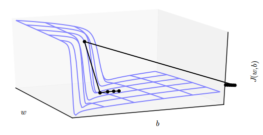
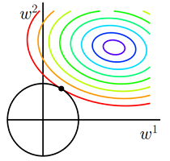
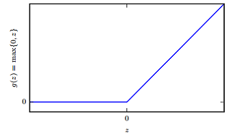
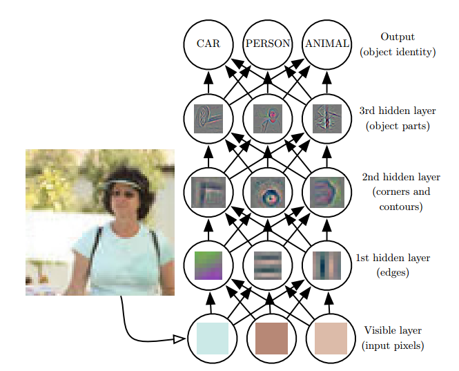
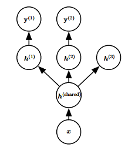
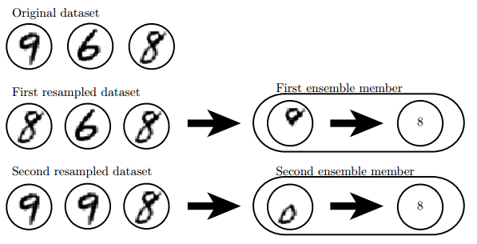
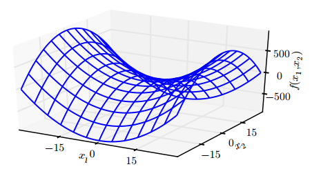

**问题列表**
<!-- TOC -->

- [1. 如何设置网络的初始值？*](#1-如何设置网络的初始值)
- [2. 梯度爆炸的解决办法***](#2-梯度爆炸的解决办法)
- [3. 神经网络/MLP 的万能近似定理*](#3-神经网络mlp-的万能近似定理)
- [4. 神经网络/MLP 中，深度与宽度的关系，及其表示能力的差异**](#4-神经网络mlp-中深度与宽度的关系及其表示能力的差异)
- [5. 在深度神经网络中，引入了隐藏层（非线性单元），放弃了训练问题的凸性，其意义何在？](#5-在深度神经网络中引入了隐藏层非线性单元放弃了训练问题的凸性其意义何在)
- [6. 稀疏表示，低维表示，独立表示*](#6-稀疏表示低维表示独立表示)
- [7. 局部不变性（平滑先验）及其在基于梯度的学习上的局限性*](#7-局部不变性平滑先验及其在基于梯度的学习上的局限性)
- [8. 为什么交叉熵损失相比均方误差损失能提高以 sigmoid 和 softmax 作为激活函数的层的性能？**](#8-为什么交叉熵损失相比均方误差损失能提高以-sigmoid-和-softmax-作为激活函数的层的性能)
- [9. 分段线性单元（如 ReLU）代替 sigmoid 的利弊***](#9-分段线性单元如-relu代替-sigmoid-的利弊)
- [10. 在做正则化过程中，为什么只对权重做正则惩罚，而不对偏置做权重惩罚*](#10-在做正则化过程中为什么只对权重做正则惩罚而不对偏置做权重惩罚)
- [11. 列举常见的一些范数及其应用场景，如 L0, L1, L2, L∞, Frobenius 范数**](#11-列举常见的一些范数及其应用场景如-l0-l1-l2-l∞-frobenius-范数)
    - [11.1. 权重衰减的目的](#111-权重衰减的目的)
- [12. L1 和 L2 范数的异同***](#12-l1-和-l2-范数的异同)
- [13. 为什么 L1 正则化可以产生稀疏权值，L2 正则化可以防止过拟合？**](#13-为什么-l1-正则化可以产生稀疏权值l2-正则化可以防止过拟合)
    - [13.1. 为什么 L1 正则化可以产生稀疏权值，而 L2 不会？](#131-为什么-l1-正则化可以产生稀疏权值而-l2-不会)
    - [13.2. 为什么 L1 和 L2 正则化可以防止过拟合？](#132-为什么-l1-和-l2-正则化可以防止过拟合)
- [14. 简单介绍常用的激活函数，如 sigmoid, relu, softplus, tanh, RBF 及其应用场景***](#14-简单介绍常用的激活函数如-sigmoid-relu-softplus-tanh-rbf-及其应用场景)
    - [14.1. 整流线性单元（ReLU）](#141-整流线性单元relu)
    - [14.2. sigmoid 与 tanh（双曲正切函数）](#142-sigmoid-与-tanh双曲正切函数)
    - [14.3. 其他激活函数（隐藏单元）](#143-其他激活函数隐藏单元)
    - [14.4. sigmoid 和 softplus 的一些性质](#144-sigmoid-和-softplus-的一些性质)
- [15. Jacobian 和 Hessian 矩阵及其在深度学习中的重要性*](#15-jacobian-和-hessian-矩阵及其在深度学习中的重要性)
- [16. 信息论、KL 散度（相对熵）与交叉熵**](#16-信息论kl-散度相对熵与交叉熵)
    - [16.1. 自信息与信息熵](#161-自信息与信息熵)
    - [16.2. 相对熵（KL 散度）与交叉熵](#162-相对熵kl-散度与交叉熵)
- [17. 如何避免数值计算中的上溢和下溢问题，以 softmax 为例*](#17-如何避免数值计算中的上溢和下溢问题以-softmax-为例)
- [18. 训练误差、泛化误差；过拟合、欠拟合；模型容量，表示容量，有效容量，最优容量的概念； 奥卡姆剃刀原则*](#18-训练误差泛化误差过拟合欠拟合模型容量表示容量有效容量最优容量的概念-奥卡姆剃刀原则)
- [19. 高斯分布的广泛应用的原因**](#19-高斯分布的广泛应用的原因)
    - [19.1. 高斯分布（Gaussian distribution）](#191-高斯分布gaussian-distribution)
    - [19.2. 为什么推荐使用高斯分布？](#192-为什么推荐使用高斯分布)
- [20. 表示学习、自编码器与深度学习](#20-表示学习自编码器与深度学习)
- [21. L1/L2 正则化与 MAP 贝叶斯推断*](#21-l1l2-正则化与-map-贝叶斯推断)
- [22. 什么是欠约束，为什么大多数的正则化可以使欠约束下的欠定问题在迭代过程中收敛*](#22-什么是欠约束为什么大多数的正则化可以使欠约束下的欠定问题在迭代过程中收敛)
- [23. 为什么考虑在模型训练时对输入 (隐藏单元／权重) 添加方差较小的噪声？*](#23-为什么考虑在模型训练时对输入-隐藏单元／权重-添加方差较小的噪声)
- [24. 多任务学习、参数绑定和参数共享***](#24-多任务学习参数绑定和参数共享)
    - [24.1. 多任务学习](#241-多任务学习)
    - [24.2. 参数绑定和参数共享](#242-参数绑定和参数共享)
- [25. Dropout 与 Bagging 集成方法的关系，Dropout 带来的意义与其强大的原因***](#25-dropout-与-bagging-集成方法的关系dropout-带来的意义与其强大的原因)
    - [25.1. Bagging 集成方法](#251-bagging-集成方法)
    - [25.2. Dropout (Srivastava et al., 2014)](#252-dropout-srivastava-et-al-2014)
- [26. 批梯度下降法（Batch SGD）更新过程中，批的大小会带来怎样的影响~~，与各种更新的稳定性关系~~**](#26-批梯度下降法batch-sgd更新过程中批的大小会带来怎样的影响与各种更新的稳定性关系)
- [27. 如何避免深度学习中的病态，鞍点，梯度爆炸，梯度弥散？***](#27-如何避免深度学习中的病态鞍点梯度爆炸梯度弥散)
    - [27.1. 病态（ill-conditioning）](#271-病态ill-conditioning)
    - [27.2. 鞍点（saddle point）](#272-鞍点saddle-point)
    - [27.3. 长期依赖于梯度爆炸、消失](#273-长期依赖于梯度爆炸消失)

<!-- /TOC -->

# 1. 如何设置网络的初始值？*

一般总是使用服从（截断）高斯或均匀分布的随机值，具体是高斯还是均匀分布影响不大，但是也没有详细的研究。

但是，**初始值的大小**会对优化结果和网络的泛化能力产生较大的影响：更大的初始值有助于避免冗余的单元和梯度消失；但如果初始值太大，又会造成梯度爆炸。

> 《深度学习》 ch8.4 - 参数初始化策略

一些启发式初始化策略通常是根据输入与输出的单元数来决定初始权重的大小，比如 Glorot and Bengio (2010) 中建议建议使用的标准初始化，其中 m 为输入数，n 为输出数

[](http://www.codecogs.com/eqnedit.php?latex=W_{i,j}&space;\sim&space;U(-\sqrt{\frac{6}{m&plus;n}},\sqrt{\frac{6}{m&plus;n}}))

还有一些方法推荐使用随机正交矩阵来初始化权重 (Saxe et al., 2013)。

> 常用的初始化策略可以参考 Keras 中文文档：[初始化方法Initializers](http://keras-cn.readthedocs.io/en/latest/other/initializations/)


# 2. 梯度爆炸的解决办法***
> [27. 如何避免深度学习中的病态，鞍点，梯度爆炸，梯度弥散？***](#27-如何避免深度学习中的病态鞍点梯度爆炸梯度弥散)

**梯度爆炸**：


    
1. **梯度截断**（gradient clipping）——如果梯度超过某个阈值，就对其进行限制

    > 《深度学习》 ch10.11.1 - 截断梯度
    
    下面是 Tensorflow 提供的几种方法：

    - `tf.clip_by_value(t, clip_value_min, clip_value_max)`
    - `tf.clip_by_norm(t, clip_norm)`
    - `tf.clip_by_average_norm(t, clip_norm)`
    - `tf.clip_by_global_norm(t_list, clip_norm)`

    这里以`tf.clip_by_global_norm`为例：

    ```
    To perform the clipping, the values `t_list[i]` are set to:

        t_list[i] * clip_norm / max(global_norm, clip_norm)

    where:

        global_norm = sqrt(sum([l2norm(t)**2 for t in t_list]))
    ```

    用法：

    ```
    train_op = tf.train.AdamOptimizer()
    params = tf.trainable_variables()
    gradients = tf.gradients(loss, params)

    clip_norm = 100
    clipped_gradients, global_norm = tf.clip_by_global_norm(gradients, clip_norm)

    optimizer_op = train_op.apply_gradients(zip(clipped_gradients, params))
    ```

    > clip_norm 的设置视 loss 的大小而定，如果比较大，那么可以设为 100 或以上，如果比较小，可以设为 10 或以下。

2. 良好的参数初始化策略也能缓解梯度爆炸问题（权重正则化）

    > [如何设置网络的初始值？](#1.-如何设置网络的初始值？)

3. 使用线性整流激活函数，如 ReLU 等


# 3. 神经网络/MLP 的万能近似定理*

一个前馈神经网络如果具有至少一个非线性输出层，那么只要给予网络足够数量的隐藏单元，它就可以以任意的精度来近似任何从一个有限维空间到另一个有限维空间的函数。

> 《深度学习》 ch6.4.1 - 万能近似性质和深度


# 4. 神经网络/MLP 中，深度与宽度的关系，及其表示能力的差异**
    
隐藏层的数量称为模型的**深度**，隐藏层的维数（单元数）称为该层的**宽度**。

**万能近似定理**表明一个单层的网络就足以表达任意函数，但是该层的维数可能非常大，且几乎没有泛化能力；此时，使用更深的模型能够减少所需的单元数，同时增强泛化能力（减少泛化误差）。参数数量相同的情况下，浅层网络比深层网络更容易过拟合。

> 《深度学习》 ch6.4 - 架构设计；这一节的内容比较分散，想要更好的回答这个问题，需要理解深度学习的本质——学习多层次组合（ch1.2），这才是现代深度学习的基本原理。


# 5. 在深度神经网络中，引入了隐藏层（非线性单元），放弃了训练问题的凸性，其意义何在？

放弃训练问题的凸性，简单来说，就是放弃寻求问题的最优解。

**非线性单元**的加入，使训练问题不再是一个**凸优化**问题。这意味着神经网络很难得到最优解，即使一个只有两层和三个节点的简单神经网络，其训练优化问题仍然是 NP-hard 问题 (Blum & Rivest, 1993).

但即使如此，使用神经网络也是利大于弊的：
- 人类设计者只需要寻找正确的**函数族**即可，而不需要去寻找精确的函数。
- 使用简单的梯度下降优化方法就可以高效地找到足够好的局部最小值
- 增强了模型的学习/拟合能力，如原书中所说“ maxout 单元可以以任意精度近似任何凸函数”。至于放弃凸性后的优化问题可以在结合工程实践来不断改进。 “似乎传统的优化理论结果是残酷的，但我们可以通过**工程方法**和**数学技巧**来尽量规避这些问题，例如启发式方法、增加更多的机器和使用新的硬件（如GPU）。”

> [Issue #1](https://github.com/elviswf/DeepLearningBookQA_cn/issues/1#issuecomment-396061806) · elviswf/DeepLearningBookQA_cn 
>
> 《深度学习》 ch6 - 深度前馈网络（引言） & ch6.3 - 隐藏单元

# 6. 稀疏表示，低维表示，独立表示*

无监督学习任务的目的是找到数据的“最佳”表示。“最佳”可以有不同的表示，但是一般来说，是指该表示在比本身表示的信息更简单的情况下，尽可能地保存关于 x 更多的信息。

低维表示、稀疏表示和独立表示是最常见的三种“简单”表示：1）低维表示尝试将 x 中的信息尽可能压缩在一个较小的表示中；2）稀疏表示将数据集嵌入到输入项大多数为零的表示中；3）独立表示试图分开数据分布中变化的来源，使得表示的维度是统计独立的。

这三种表示不是互斥的，比如主成分分析（PCA）就试图同时学习低维表示和独立表示。

表示的概念是深度学习的核心主题之一。

> 《深度学习》 ch5.8 - 无监督学习算法
    

# 7. 局部不变性（平滑先验）及其在基于梯度的学习上的局限性*

局部不变性：函数在局部小区域内不会发生较大的变化。

为了更好地**泛化**，机器学习算法需要由一些先验来引导应该学习什么类型的函数。

其中最广泛使用的“隐式先验”是平滑先验（smoothness prior），也称局部不变性先验（local constancy prior）。许多简单算法完全依赖于此先验达到良好的（局部）泛化，一个极端例子是 k-最近邻系列的学习算法。

但是仅依靠平滑先验**不足以**应对人工智能级别的任务。简单来说，区分输入空间中 O(k) 个区间，需要 O(k) 个样本，通常也会有 O(k) 个参数。最近邻算法中，每个训练样本至多用于定义一个区间。类似的，决策树也有平滑学习的局限性。

以上问题可以总结为：是否可以有效地表示复杂的函数，以及所估计的函数是否可以很好地泛化到新的输入。该问题的一个关键观点是，只要我们通过额外假设生成数据的分布来建立区域间的依赖关系，那么 O(k) 个样本足以描述多如 O(2^k) 的大量区间。通过这种方式，能够做到**非局部的泛化**。

> 《深度学习》 ch5.11.2 - 局部不变性与平滑正则化
>
> 一些其他的机器学习方法往往会提出更强的，针对特定问题的假设，例如周期性。通常，神经网络不会包含这些很强的针对性假设——深度学习的核心思想是假设数据由因素或特征组合产生，这些因素或特征可能来自一个层次结构的多个层级。许多其他类似的通用假设进一步提高了深度学习算法。这些很温和的假设允许了样本数目和可区分区间数目之间的**指数增益**。深度的分布式表示带来的指数增益有效地解决了维数灾难带来的挑战
>> 指数增益：《深度学习》 ch6.4.1、ch15.4、ch15.5


# 8. 为什么交叉熵损失相比均方误差损失能提高以 sigmoid 和 softmax 作为激活函数的层的性能？**

《深度学习》 ch6.6 - 小结中提到了这个结论，但是没有给出具体原因（可能在前文）。

简单来说，就是使用均方误差（MSE）作为损失函数时，会导致大部分情况下**梯度偏小**，其结果就是权重的更新很慢，且容易造成“梯度消失”现象。而交叉熵损失克服了这个缺点，当误差大的时候，权重更新就快，当误差小的时候，权重的更新才慢。

具体推导过程如下：

> https://blog.csdn.net/guoyunfei20/article/details/78247263 - CSDN 博客
>
> 这里给出了一个具体的[例子](https://blog.csdn.net/shmily_skx/article/details/53053870)
    

# 9. 分段线性单元（如 ReLU）代替 sigmoid 的利弊***

- 当神经网络比较小时，sigmoid 表现更好；
- 在深度学习早期，人们认为应该避免具有不可导点的激活函数，而 ReLU 不是全程可导/可微的
- sigmoid 和 tanh 的输出是有界的，适合作为下一层的输入，以及整个网络的输出。实际上，目前大多数网络的输出层依然使用的 sigmoid（单输出） 或 softmax（多输出）。

    > 为什么 ReLU 不是全程可微也能用于基于梯度的学习？——虽然 ReLU 在 0 点不可导，但是它依然存在左导数和右导数，只是它们不相等（相等的话就可导了），于是在实现时通常会返回左导数或右导数的其中一个，而不是报告一个导数不存在的错误。
    >> 一阶函数：可微==可导

- 对于小数据集，使用整流非线性甚至比学习隐藏层的权重值更加重要 (Jarrett et al., 2009b)
- 当数据增多时，在深度整流网络中的学习比在激活函数具有曲率或两侧**饱和**的深度网络中的学习更容易 (Glorot et al., 2011a)：传统的 sigmoid 函数，由于两端饱和，在传播过程中容易丢弃信息
- ReLU 的过程更接近生物神经元的作用过程

    > 饱和（saturate）现象：在函数图像上表现为变得很平，对输入的微小改变会变得不敏感。

> 《深度学习》 ch6.6 - 小结
>
> https://blog.csdn.net/code_lr/article/details/51836153 - CSDN博客
>> 答案总结自该知乎问题：https://www.zhihu.com/question/29021768
    

# 10. 在做正则化过程中，为什么只对权重做正则惩罚，而不对偏置做权重惩罚*

在神经网络中，参数包括每一层仿射变换的**权重**和**偏置**，我们通常只对权重做惩罚而不对偏置做正则惩罚。

精确拟合偏置所需的数据通常比拟合权重少得多。每个权重会指定两个变量如何相互作用。我们需要在各种条件下观察这两个变量才能良好地拟合权重。而每个偏置仅控制一个单变量。这意味着，我们不对其进行正则化也不会导致太大的方差。另外，正则化偏置参数可能会导致明显的欠拟合。

> 《深度学习》 ch7.1 - 参数范数惩罚


# 11. 列举常见的一些范数及其应用场景，如 L0, L1, L2, L∞, Frobenius 范数**

L0: 向量中非零元素的个数

L1: 向量中所有元素的绝对值之和

[](http://www.codecogs.com/eqnedit.php?latex=\left&space;\|&space;x&space;\right&space;\|_1=\sum_i{\left&space;|&space;x_i&space;\right&space;|})

L2: 向量中所有元素平方和的开放

[](http://www.codecogs.com/eqnedit.php?latex=\left&space;\|&space;x&space;\right&space;\|_2=\sqrt{\sum_i{\left&space;|&space;x_i&space;\right&space;|^2}})

其中 L1 和 L2 范数分别是 Lp (p>=1) 范数的特例：

[](http://www.codecogs.com/eqnedit.php?latex=\left&space;\|&space;x&space;\right&space;\|_p=(\sum_i{\left&space;|&space;x_i&space;\right&space;|^2})^{\frac{1}{p}})

L∞: 向量中最大元素的绝对值，也称最大范数

[](http://www.codecogs.com/eqnedit.php?latex=\left&space;\|&space;x&space;\right&space;\|_\infty=\max_i\left&space;|&space;x&space;\right&space;|)

Frobenius 范数：作用于矩阵的 L2 范数

[](http://www.codecogs.com/eqnedit.php?latex=\left&space;\|&space;A&space;\right&space;\|_F=\sqrt{\sum_{i,j}A_{i,j}^2})

> 《深度学习》 ch2.5 - 范数（介绍），ch

范数最主要的应用：正则化——权重衰减/参数范数惩罚

## 11.1. 权重衰减的目的

限制模型的学习能力，通过限制参数 θ 的规模（主要是权重 w 的规模，偏置 b 不参与惩罚），使模型偏好于权值较小的目标函数，防止过拟合。

> 《深度学习》 ch7.1 - 参数范数惩罚


# 12. L1 和 L2 范数的异同***

**相同点**
- 限制模型的学习能力，通过限制参数的规模，使模型偏好于权值较小的目标函数，防止过拟合。

**不同点**
- L1 正则化可以产生稀疏权值矩阵，即产生一个稀疏模型，可以用于特征选择；一定程度上防止过拟合
- L2 正则化主要用于防止模型过拟合
- L1 适用于特征之间有关联的情况；L2 适用于特征之间没有关联的情况

> 《深度学习》 ch7.1.1 - L2参数正则化 & ch7.1.2 - L1参数正则化
>
> [机器学习中正则化项L1和L2的直观理解](https://blog.csdn.net/jinping_shi/article/details/52433975) - CSDN博客


# 13. 为什么 L1 正则化可以产生稀疏权值，L2 正则化可以防止过拟合？**

## 13.1. 为什么 L1 正则化可以产生稀疏权值，而 L2 不会？

添加 L1 正则化，相当于在 L1范数的约束下求目标函数 J 的最小值，下图展示了二维的情况：


图中 J 与 L 首次相交的点就是最优解。L1 在和每个坐标轴相交的地方都会有“角”出现（多维的情况下，这些角会更多），在角的位置就会产生稀疏的解。而 J 与这些“角”相交的机会远大于其他点，因此 L1 正则化会产生稀疏的权值。

类似的，可以得到带有 L2正则化的目标函数在二维平面上的图形，如下：



相比 L1，L2 不会产生“角”，因此 J 与 L2 相交的点具有稀疏性的概率就会变得非常小。

> [机器学习中正则化项L1和L2的直观理解](https://blog.csdn.net/jinping_shi/article/details/52433975) - CSDN博客

## 13.2. 为什么 L1 和 L2 正则化可以防止过拟合？

L1 & L2 正则化会使模型偏好于更小的权值。

简单来说，更小的权值意味着更低的模型复杂度，也就是对训练数据的拟合刚刚好（奥卡姆剃刀），不会过分拟合训练数据（比如异常点，噪声），以提高模型的泛化能力。

此外，添加正则化相当于为模型添加了某种**先验**（限制），规定了参数的分布，从而降低了模型的复杂度。模型的复杂度降低，意味着模型对于噪声与异常点的抗干扰性的能力增强，从而提高模型的泛化能力。

> [机器学习中防止过拟合的处理方法](https://blog.csdn.net/heyongluoyao8/article/details/49429629) - CSDN博客


# 14. 简单介绍常用的激活函数，如 sigmoid, relu, softplus, tanh, RBF 及其应用场景***

## 14.1. 整流线性单元（ReLU）

[](http://www.codecogs.com/eqnedit.php?latex=g(z)=\max(0,z))



整流线性单元（ReLU）通常是激活函数较好的默认选择。

整流线性单元易于优化，因为它们和线性单元非常类似。线性单元和整流线性单元的唯一区别在于整流线性单元在其一半的定义域上输出为零。这使得只要整流线性单元处于激活状态，它的导数都能保持较大。它的梯度不仅大而且一致。整流操作的二阶导数几乎处处为 0，并且在整流线性单元处于激活状态时，它的一阶导数处处为 1。这意味着相比于引入二阶效应的激活函数来说，它的梯度方向对于学习来说更加有用。

**ReLU 的拓展**

ReLU 的三种拓展都是基于以下变型：

[](http://www.codecogs.com/eqnedit.php?latex=g(z,\alpha)&space;=\max(0,z)&plus;\alpha\min(0,z))

ReLU 及其扩展都是基于一个原则，那就是如果它们的行为更接近线性，那么模型更容易优化。

- 绝对值整流（absolute value rectification）
    
    固定 α == -1，此时整流函数即一个绝对值函数
    
    [](http://www.codecogs.com/eqnedit.php?latex=g(z)&space;=\left&space;|&space;z&space;\right&space;|)

    绝对值整流被用于图像中的对象识别 (Jarrett et al., 2009a)，其中寻找在输入照明极性反转下不变的特征是有意义的。

- 渗漏整流线性单元（Leaky ReLU, Maas et al., 2013）
    
    固定 α 为一个类似于 0.01 的小值

- 参数化整流线性单元（parametric ReLU, PReLU, He et al., 2015）

    将 α 作为一个参数学习

- maxout 单元 (Goodfellow et al., 2013a)

    maxout 单元 进一步扩展了 ReLU，它是一个可学习的多达 k 段的分段函数

    关于 maxout 网络的分析可以参考论文或网上的众多分析，下面是 Keras 中的实现：
    ```
    # input shape:  [n, input_dim]
    # output shape: [n, output_dim]
    W = init(shape=[k, input_dim, output_dim])
    b = zeros(shape=[k, output_dim])
    output = K.max(K.dot(x, W) + b, axis=1)
    ```
    > [深度学习（二十三）Maxout网络学习](https://blog.csdn.net/hjimce/article/details/50414467) - CSDN博客

## 14.2. sigmoid 与 tanh（双曲正切函数）

在引入 ReLU 之前，大多数神经网络使用 sigmoid 激活函数：

[](http://www.codecogs.com/eqnedit.php?latex=g(z)=\sigma(z)=\frac{1}{1&plus;\exp(-z)})


或者 tanh（双曲正切函数）：

[](http://www.codecogs.com/eqnedit.php?latex=g(z)&space;=&space;\tanh(z))

tanh 的图像类似于 sigmoid，区别在其值域为 (-1, 1).

这两个函数有如下关系：

[](http://www.codecogs.com/eqnedit.php?latex=\tanh(z)=2\sigma&space;(2z)-1)

**sigmoid 函数要点**：
- sigmoid 常作为输出单元用来预测二值型变量取值为 1 的概率
    > 换言之，sigmoid 函数可以用来产生**伯努利分布**中的参数 ϕ，因为它的值域为 (0, 1).
- sigmoid 函数在输入取绝对值非常大的正值或负值时会出现**饱和**（saturate）现象，在图像上表现为开始变得很平，此时函数会对输入的微小改变会变得不敏感。仅当输入接近 0 时才会变得敏感。
    > 饱和现象会导致基于梯度的学习变得困难，并在传播过程中丢失信息。——[为什么用ReLU代替sigmoid？](#8.-分段线性单元（如-ReLU）代替-sigmoid-的利弊)
- 如果要使用 sigmoid 作为激活函数时（浅层网络），tanh 通常要比 sigmoid 函数表现更好。
    > tanh 在 0 附近与单位函数类似，这使得训练 tanh 网络更容易些。

## 14.3. 其他激活函数（隐藏单元）

很多未发布的非线性激活函数也能表现的很好，但没有比流行的激活函数表现的更好。比如使用 cos 也能在 MNIST 任务上得到小于 1% 的误差。通常新的隐藏单元类型只有在被明确证明能够提供显著改进时才会被发布。

**线性激活函数**：

如果神经网络的每一层都都由线性变换组成，那么网络作为一个整体也将是线性的，这会导致失去万能近似的性质。但是，仅**部分层是纯线性**是可以接受的。这可以帮助**减少网络中的参数**。

**softmax**：

softmax 单元常作为网络的输出层，它很自然地表示了具有 k 个可能值的离散型随机变量的概率分布。

**径向基函数（radial basis function, RBF）**：

[](http://www.codecogs.com/eqnedit.php?latex=h_i=\exp(-\frac{1}{\sigma_i^2}\left&space;\|&space;W_{:,i}-x&space;\right&space;\|^2))

在神经网络中很少使用 RBF 作为激活函数，因为它对大部分 x 都饱和到 0，所以很难优化。

**softplus**：

[](http://www.codecogs.com/eqnedit.php?latex=g(z)=\zeta(z)=\log(1&plus;\exp(z)))


softplus 是 ReLU 的平滑版本。通常不鼓励使用 softplus 函数，大家可能希望它具有优于整流线性单元的点，但根据经验来看，它并没有。
> (Glorot et al., 2011a) 比较了这两者，发现 ReLU 的结果更好。

**硬双曲正切函数（hard tanh）**：

[](http://www.codecogs.com/eqnedit.php?latex=g(z)=\max(-1,\min(1,a)))

它的形状和 tanh 以及整流线性单元类似，但是不同于后者，它是有界的。
> Collobert, 2004

## 14.4. sigmoid 和 softplus 的一些性质


> 《深度学习》 ch3.10 - 常用函数的有用性质


# 15. Jacobian 和 Hessian 矩阵及其在深度学习中的重要性*

> 《深度学习》 ch4.3.1 - 梯度之上：Jacobian 和 Hessian 矩阵


# 16. 信息论、KL 散度（相对熵）与交叉熵**

信息论的基本想法是一个不太可能的事件居然发生了，要比一个非常可能的事件发生，能提供更多的信息。

该想法可描述为以下性质：
1. 非常可能发生的事件信息量要比较少，并且极端情况下，确保能够发生的事件应该没有信息量。
2. 比较不可能发生的事件具有更高的信息量。
3. 独立事件应具有增量的信息。例如，投掷的硬币两次正面朝上传递的信息量，应该是投掷一次硬币正面朝上的信息量的两倍。

## 16.1. 自信息与信息熵

自信息（self-information）是一种量化以上性质的函数，定义一个事件 x 的自信息为：

[](http://www.codecogs.com/eqnedit.php?latex=I(x)=-\log&space;P(x))

> 当该对数的底数为 e 时，单位为奈特（nats，本书标准）；当以 2 为底数时，单位为比特（bit）或香农（shannons）

自信息只处理单个的输出。此时，用信息熵（Information-entropy）来对整个概率分布中的不确定性总量进行量化：

[](http://www.codecogs.com/eqnedit.php?latex=H(\mathrm{X})=\mathbb{E}_{\mathrm{X}&space;\sim&space;P}[I(x)]=-\sum_{x&space;\in&space;\mathrm{X}}P(x)\log&space;P(x))

> 信息熵也称香农熵（Shannon entropy）
>
> 信息论中，记 `0log0 = 0`

## 16.2. 相对熵（KL 散度）与交叉熵

P 对 Q 的 **KL散度**（Kullback-Leibler divergence）：

[](http://www.codecogs.com/eqnedit.php?latex=D_P(Q)=\mathbb{E}_{\mathrm{X}\sim&space;P}\left&space;[&space;\log&space;\frac{P(x)}{Q(x)}&space;\right&space;]=\sum_{x&space;\in&space;\mathrm{X}}P(x)\left&space;[&space;P(x)-Q(x)&space;\right&space;])

**KL 散度在信息论中度量的是那个直观量**：

在离散型变量的情况下， KL 散度衡量的是，当我们使用一种被设计成能够使得概率分布 Q 产生的消息的长度最小的编码，发送包含由概率分布 P 产生的符号的消息时，所需要的额外信息量。

**KL 散度的性质**：
- 非负；KL 散度为 0 当且仅当P 和 Q 在离散型变量的情况下是相同的分布，或者在连续型变量的情况下是“几乎处处”相同的
- 不对称；D_p(q) != D_q(p)

**交叉熵**（cross-entropy）：

[](http://www.codecogs.com/eqnedit.php?latex=H_P(Q)=-\mathbb{E}_{\mathrm{X}\sim&space;P}\log&space;Q(x)=-\sum_{x&space;\in&space;\mathrm{X}}P(x)\log&space;Q(x))

> 《深度学习》 ch3.13 - 信息论
>
> [信息量，信息熵，交叉熵，KL散度和互信息（信息增益）](https://blog.csdn.net/haolexiao/article/details/70142571) - CSDN博客

**交叉熵与 KL 散度的关系**：

[](http://www.codecogs.com/eqnedit.php?latex=H_P(Q)=H(P)&plus;D_P(Q))

**针对 Q 最小化交叉熵等价于最小化 KL 散度**，因为 Q 并不参与被省略的那一项。

最大似然估计中，最小化 KL 散度其实就是在最小化分布之间的交叉熵。

> 《深度学习》 ch5.5 - 最大似然估计


# 17. 如何避免数值计算中的上溢和下溢问题，以 softmax 为例*

- **上溢**：一个很大的数被近似为 ∞ 或 -∞；
- **下溢**：一个很小的数被近似为 0

必须对上溢和下溢进行**数值稳定**的一个例子是 **softmax 函数**：

[](http://www.codecogs.com/eqnedit.php?latex=\mathrm{softmax}(x)=\frac{\exp(x_i)}{\sum_{j=1}^n&space;\exp(x_j)})

因为 softmax 解析上的函数值不会因为从输入向量减去或加上**标量**而改变，
于是一个简单的解决办法是对 x：

[](http://www.codecogs.com/eqnedit.php?latex=x=x-\max_ix_i)

减去 `max(x_i)` 导致 `exp` 的最大参数为 `0`，这排除了上溢的可能性。同样地，分母中至少有一个值为 `1=exp(0)` 的项，这就排除了因分母下溢而导致被零除的可能性。

**注意**：虽然解决了分母中的上溢与下溢问题，但是分子中的下溢仍可以导致整体表达式被计算为零。此时如果计算 log softmax(x) 时，依然要注意可能造成的上溢或下溢问题，处理方法同上。

当然，大多数情况下，这是底层库开发人员才需要注意的问题。

> 《深度学习》 ch4.1 - 上溢与下溢


# 18. 训练误差、泛化误差；过拟合、欠拟合；模型容量，表示容量，有效容量，最优容量的概念； 奥卡姆剃刀原则*

> 《深度学习》 ch5.2 - 容量、过拟合和欠拟合


# 19. 高斯分布的广泛应用的原因**

## 19.1. 高斯分布（Gaussian distribution）

高斯分布，即正态分布（normal distribution）：

[](http://www.codecogs.com/eqnedit.php?latex=N(x;\mu,\sigma^2)=\sqrt\frac{1}{2\pi\sigma^2}\exp\left&space;(&space;-\frac{1}{2\sigma^2}(x-\mu)^2&space;\right&space;))

概率密度函数图像：


其中峰的 `x` 坐标由 `µ` 给出，峰的宽度受 `σ` 控制；特别的，当 `µ = 0, σ = 1`时，称为标准正态分布

正态分布的均值 `E = µ`；标准差 `std = σ`，方差为其平方

## 19.2. 为什么推荐使用高斯分布？
当我们由于缺乏关于某个实数上分布的先验知识而不知道该选择怎样的形式时，正态分布是默认的比较好的选择，其中有两个原因：
1. 我们想要建模的很多分布的真实情况是比较接近正态分布的。**中心极限定理**（central limit theorem）说明很多独立随机变量的和近似服从正态分布。这意味着在实际中，很多复杂系统都可以被成功地建模成正态分布的噪声，即使系统可以被分解成一些更结构化的部分。
2. 第二，在具有相同方差的所有可能的概率分布中，正态分布在实数上具有最大的不确定性。因此，我们可以认为正态分布是对模型加入的先验知识量最少的分布。
    > 关于这一点的证明：《深度学习》 ch19.4.2 - 变分推断和变分学习

**多维正态分布**

正态分布可以推广到 n 维空间，这种情况下被称为**多维正态分布**。


参数 `µ` 仍然表示分布的均值，只不过现在是一个向量。参数 Σ 给出了分布的协方差矩阵（一个正定对称矩阵）。


> 《深度学习》 ch3.9.3 - 高斯分布


# 20. 表示学习、自编码器与深度学习

**表示学习**：

对于许多任务来说，我们很难知道应该提取哪些特征。解决这个问题的途径之一是使用机器学习来发掘表示本身，而不仅仅把表示映射到输出。这种方法我们称之为**表示学习**（representation learning）。学习到的表示往往比手动设计的表示表现得更好。并且它们只需最少的人工干预，就能让AI系统迅速适应新的任务。 

**自编码器**：

表示学习算法的典型例子是 自编码器（autoencoder）。自编码器由一个**编码器**（encoder）函数和一个**解码器**（decoder）函数组合而成。
- 编码器函数将输入数据转换为一种不同的表示;
- 解码器函数则将这个新的表示转换到原来的形式。

我们期望当输入数据经过编码器和解码器之后**尽可能多地保留信息**，同时希望新的表示有一些好的特性，这也是自编码器的训练目标。

**深度学习**：

深度学习（deep learning）通过简单的表示来表达复杂的表示，以解决表示学习中的核心问题。



深度学习模型的示意图

计算机难以理解原始感观输入数据的含义，如表示为像素值集合的图像，将一组像素映射到对象标识的函数非常复杂。深度学习将所需的复杂映射分解为一系列嵌套的简单映射（每个由模型的不同层描述）来解决这一难题。

输入展示在**可见层**（visible layer），这样命名的原因是因为它包含我们能观察到的变量。然后是一系列从图像中提取越来越多抽象特征的**隐藏层**（hidden layer），称为“隐藏”的原因是因为它们的值不在数据中给出。

模型必须确定哪些概念有利于解释观察数据中的关系。这里的图像是每个隐藏单元表示的特征的可视化。给定像素，**第一隐藏层**可以轻易地通过比较相邻像素的亮度来**识别边缘**。有了第一隐藏层描述的边缘，**第二隐藏层**可以容易地**搜索轮廓和角**。给定第二隐藏层中关于角和轮廓的图像描述，**第三隐藏层**可以找到轮廓和角的特定集合来**检测整个特定对象**。最后，根据图像描述中包含的对象部分，可以识别图像中存在的对象。

> 实际任务中并不一定具有这么清晰的可解释性，很多时候你并不知道每个隐藏层到底识别出了哪些特征。

学习数据的正确表示的想法是**解释深度学习**的一个视角。

> 另一个视角是深度促使计算机学习一个多步骤的计算机程序。——《深度学习》 ch1 - 引言
>
> 早期的深度学习称为神经网络，因为其主要指导思想来源于生物神经学。从神经网络向深度学习的术语转变也是因为指导思想的改变。

> 《深度学习》 ch1 - 引言


# 21. L1/L2 正则化与 MAP 贝叶斯推断*

许多正则化策略可以被解释为 MAP 贝叶斯推断：
- L2 正则化相当于权重是高斯先验的 MAP 贝叶斯推断
- 对于 L1正则化，用于正则化代价函数的惩罚项与通过 MAP 贝叶斯推断最大化的**对数先验项**是等价的

> 《深度学习》 ch5.6.1 - 最大后验 (MAP) 估计


# 22. 什么是欠约束，为什么大多数的正则化可以使欠约束下的欠定问题在迭代过程中收敛*

> 《深度学习》 ch7.3 - 正则化与欠约束问题


# 23. 为什么考虑在模型训练时对输入 (隐藏单元／权重) 添加方差较小的噪声？*

对于某些模型而言，向输入添加方差极小的噪声等价于对权重施加范数惩罚 (Bishop, 1995a,b)。

在一般情况下，**注入噪声比简单地收缩参数强大**。特别是噪声被添加到**隐藏单元**时会更加强大，**Dropout** 方法正是这种做法的主要发展方向。

另一种正则化模型的噪声使用方式是将其加到**权重**。这项技术主要用于循环神经网络 (Jim et al., 1996; Graves, 2011)。这可以被解释为关于权重的贝叶斯推断的随机实现。贝叶斯学习过程将权重视为不确定的，并且可以**通过概率分布表示这种不确定性**。向权重添加噪声是反映这种不确定性的一种实用的随机方法。

> 《深度学习》 ch7.5 - 噪声鲁棒性


# 24. 多任务学习、参数绑定和参数共享***

## 24.1. 多任务学习

多任务学习 (Caruana, 1993) 是通过**合并多个任务中的样例**（可以视为对参数施加软约束）来提高泛化的一种方式。

正如额外的训练样本能够将模型参数推向具有更好泛化能力的值一样，当**模型的一部分被多个额外的任务共享**时，这部分将被约束为良好的值（如果共享合理），通常会带来更好的泛化能力。

**多任务学习中一种普遍形式**：



多任务学习在深度学习框架中可以以多种方式进行，该图展示了一种普遍形式：任务共享相同输入但涉及不同目标随机变量。

在该示例中，额外假设顶层隐藏单元 h(1) 和 h(2) 专用于不同的任务——分别预测 y(1) 和 y(2)，而一些**中间层表示** h(shared) 在所有任务之间共享；h(3) 表示无监督学习的情况。

这里的基本假设是存在解释输入 x 变化的**共同因素池**，而每个任务与这些因素的**子集**相关联。

该模型通常可以分为两类相关的参数：
1. 具体任务的参数（只能从各自任务的样本中实现良好的泛化）
2. 所有任务共享的通用参数（从所有任务的汇集数据中获益）——参数共享

因为**共享参数**，其统计强度可大大提高（共享参数的样本数量相对于单任务模式增加的比例），并能改善泛化和泛化误差的范围 (Baxter, 1995)。

参数共享仅当不同的任务之间存在某些统计关系的假设是合理（意味着某些参数能通过不同任务共享）时才会发生这种情况

> 《深度学习》 ch7.7 - 多任务学习

## 24.2. 参数绑定和参数共享

**参数绑定**：

有时，我们可能无法准确地知道应该使用什么样的参数，但我们根据相关领域和模型结构方面的知识得知模型参数之间应该存在一些相关性。

考虑以下情形：我们有两个模型执行相同的分类任务（具有相同类别），但输入分布稍有不同。

形式地，我们有参数为 w(A) 的模型 A 和参数为 w(B) 的模型 B。这两种模型将输入映射到两个不同但相关的输出： y(A) = f(x;w(A)) 和 y(B) = f(x;w(B))

可以想象，这些任务会足够相似（或许具有相似的输入和输出分布），因此我们认为模型参数 w(A) 和 w(B) 应彼此靠近。具体来说，我们可以使用以下形式的参数范数惩罚（这里使用的是 L2 惩罚，也可以使用其他选择）：

[](http://www.codecogs.com/eqnedit.php?latex=\Omega&space;(w^{(A)},w^{(B)})=\left&space;\|&space;w^{(A)}-w^{(B)}&space;\right&space;\|^2_2)

**参数共享**是这个思路下更流行的做法——强迫部分参数相等

和正则化参数使其接近（通过范数惩罚）相比，参数共享的一个显著优点是能够“减少内存”——只有参数（唯一一个集合）的子集需要被存储在内存中，特别是在 CNN 中。

> 《深度学习》 ch7.9 - 参数绑定和参数共享


# 25. Dropout 与 Bagging 集成方法的关系，Dropout 带来的意义与其强大的原因***

## 25.1. Bagging 集成方法

**集成方法**：

其主要想法是分别训练几个不同的模型，然后让所有模型表决测试样例的输出。这是机器学习中常规策略的一个例子，被称为**模型平均**（model averaging）。采用这种策略的技术被称为**集成方法**。

模型平均（model averaging）**奏效的原因**是不同的模型通常不会在测试集上产生完全相同的误差。平均上， 集成至少与它的任何成员表现得一样好，并且**如果成员的误差是独立的**，集成将显著地比其成员表现得更好。

**Bagging**：

Bagging（bootstrap aggregating）是通过结合几个模型降低泛化误差的技术 (Breiman, 1994)。

具体来说， Bagging 涉及构造 k 个**不同的数据集**。每个数据集从原始数据集中**重复采样**构成，和原始数据集具有**相同数量**的样例。这意味着，每个数据集以高概率缺少一些来自原始数据集的例子，还包含若干重复的例子（更具体的，如果采样所得的训练集与原始数据集大小相同，那所得数据集中大概有原始数据集 **2/3** 的实例）



**图像说明**：该图描述了 Bagging 如何工作。假设我们在上述数据集（包含一个 8、一个 6 和一个 9）上**训练数字 8** 的检测器。假设我们制作了两个不同的重采样数据集。 Bagging 训练程序通过有放回采样构建这些数据集。第一个数据集忽略 9 并重复 8。在这个数据集上，检测器得知数字**顶部有一个环就对应于一个 8**。第二个数据集中，我们忽略 6 并重复 9。在这种情况下，检测器得知数字**底部有一个环就对应于一个 8**。这些单独的分类规则中的每一个都是不可靠的，但如果我们平均它们的输出，就能得到鲁棒的检测器，**只有当 8 的两个环都存在时才能实现最大置信度**。

**集成方法与神经网络**：

神经网络能找到足够多的不同的解，意味着他们可以从模型平均中受益 (即使所有模型都在同一数据集上训练)。 

神经网络中**随机初始化**的差异、 **批训练数据**的随机选择、**超参数**的差异或**不同输出**的非确定性实现往往足以使得集成中的不同成员具有**部分独立的误差**。

> 《深度学习》 ch7.11 - Bagging 和其他集成方法

## 25.2. Dropout (Srivastava et al., 2014)

**Dropout 的意义与强大的原因**：

简单来说，Dropout 通过**参数共享**提供了一种廉价的 **Bagging** 集成近似，能够训练和评估**指数级数量**的神经网络。


Dropout 训练的集成包括所有从基础网络除去部分单元后形成的子网络。具体而言，只需将一些单元的**输出乘零**就能有效地删除一个单元。

通常，**隐藏层**的采样概率为 0.5，**输入**的采样概率为 0.8；超参数也可以采样，但其采样概率一般为 1

**Dropout与Bagging的不同点**：
- 在 Bagging 的情况下，所有模型都是独立的；而在 Dropout 的情况下，所有模型**共享参数**，其中每个模型继承父神经网络参数的不同子集。
- 在 Bagging 的情况下，每一个模型都会在其相应训练集上训练到收敛。而在 Dropout 的情况下，通常大部分模型都没有显式地被训练；取而代之的是，在单个步骤中我们训练一小部分的子网络，参数共享会使得剩余的子网络也能有好的参数设定。

**权重比例推断规则**：

简单来说，如果我们使用使用 0.5 的包含概率（keep prob），权重比例规则相当于在训练结束后**将权重除 2**，然后像平常一样使用模型；等价的，另一种方法是在训练期间将单元的状态乘 2。

无论哪种方式，我们的目标是确保在测试时一个单元的期望总输入与在训练时该单元的期望总输入是大致相同的（即使近半单位在训练时丢失）。

> 《深度学习》 ch7.12 - Dropout


# 26. 批梯度下降法（Batch SGD）更新过程中，批的大小会带来怎样的影响~~，与各种更新的稳定性关系~~**

特别说明：本书中，“**批量**”指使用使用全部训练集；“**小批量**”才用来描述小批量随机梯度下降算法中用到的小批量样本；而**随机梯度下降**（SGD）通常指每次只使用单个样本

**批的大小**通常由以下几个因素决定：
- **较大的批能得到更精确的梯度估计**，但回报是小于线性的。
- **较小的批能带来更好的泛化误差**，泛化误差通常在批大小为 1 时最好。但是，因为梯度估计的高方差，小批量训练需要**较小的学习率**以保持稳定性，这意味着**更长的训练时间**。
    > 可能是由于小批量在学习过程中加入了噪声，它们会有一些正则化效果 (Wilson
and Martinez, 2003)
- **内存消耗和批的大小成正比**，如果批量处理中的所有样本可以并行地处理（通常确是如此）。
- 在某些硬件上使用特定大小可以减少运行时间。尤其是在使用 GPU 时，通常使用 **2 的幂数**作为批量大小可以获得更少的运行时间。一般，2 的幂数的**取值范围是 32 到 256**，16 有时在尝试大模型时使用。
- 小批量更容易利用**多核架构**，但是太小的批并不会减少计算时间，这促使我们使用一些**绝对最小批量**

很多机器学习上的优化问题都可以分解成并行地计算不同样本上单独的更新。换言之，我们在计算小批量样本 X 上最小化 J(X) 的更新时，同时可以计算其他小批量样本上的更新。
> 异步并行分布式方法 -> 《深度学习》 ch12.1.3 - 大规模的分布式实现

> 《深度学习》 ch8.1.3 - 批量算法和小批量算法


# 27. 如何避免深度学习中的病态，鞍点，梯度爆炸，梯度弥散？***

## 27.1. 病态（ill-conditioning）

**什么是病态？** 
> [神经网络优化中的病态问题](https://blog.csdn.net/foolsnowman/article/details/51614862) - CSDN博客
>
> [什么是 ill-conditioning 对SGD有什么影响？](https://www.zhihu.com/question/56977045) - 知乎 

病态问题普遍存在于数值优化、凸优化或其他形式的优化中 -> ch4.3.1 - 梯度之上：Jacobian 和 Hessian 矩阵

在神经网络中，病态体现在随机梯度下降会“卡”在某些情况，此时即使很小的更新步长也会增加代价函数。此时，尽管梯度很强，学习却会变得非常缓慢

> 《深度学习》 ch8.2.1 - 病态

## 27.2. 鞍点（saddle point）

对于很多高维非凸函数（神经网络）而言，局部极小值/极大值事实上都**远少于**另一类梯度为零的点：鞍点

**什么是鞍点？**

> 《深度学习》 ch4.3 - 基于梯度的优化方法

二维和三维中的鞍点：

 


**鞍点激增对于训练算法来说有哪些影响？**

对于只使用梯度信息的一阶优化算法（随机梯度下降）而言，目前情况还不清楚。不过，虽然鞍点附近的梯度通常会非常小，但是 Goodfellow et al. (2015) 认为连续的梯度下降**会逃离而不是吸引到鞍点**。

对于牛顿法（二阶梯度）而言，鞍点问题会比较明显。不过神经网络中很少使用二阶梯度进行优化。

## 27.3. 长期依赖于梯度爆炸、消失

当计算图变得很深时（循环神经网络），神经网络优化算法会面临的另外一个难题就是**长期依赖**，由于变深的结构使模型丧失了学习到先前信息的能力，让优化变得极其困难；具体来说，就是**梯度消失**和**梯度爆炸**。

**如何优化长期依赖问题**
> 《深度学习》 ch10.11 - 优化长期依赖

**如何避免梯度爆炸？**
> [2. 梯度爆炸的解决办法***](#2-梯度爆炸的解决办法)

**如何缓解梯度消失？**

梯度截断有助于处理爆炸的梯度，但它无助于梯度消失。

> 《深度学习》 ch8.2 - 神经网络优化中的挑战